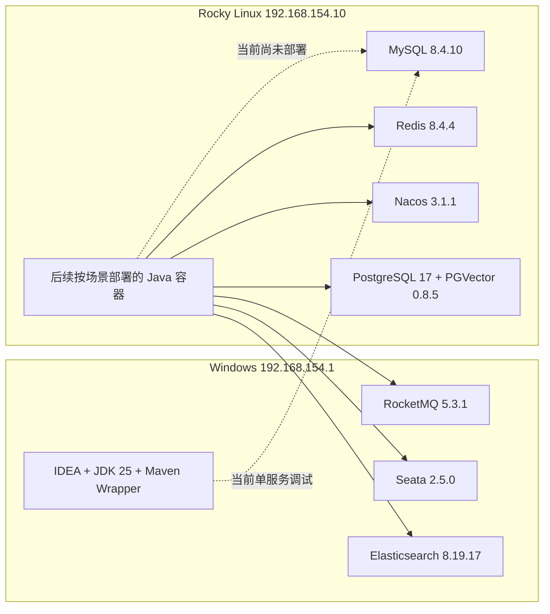
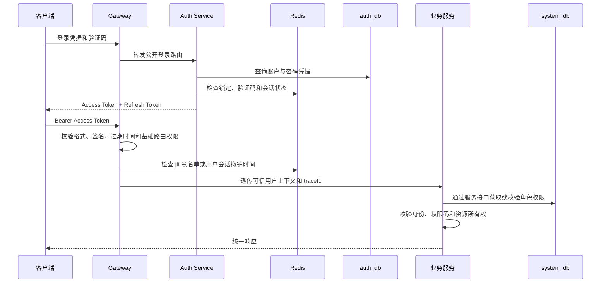

# 跨境智汇 AI 系统认证授权、组件部署与数据库手册

> 文档类型：开发环境运维手册 + 认证授权说明 + 数据库台账  
> 最近实时核查：2026-07-11 19:13:06 +08:00  
> 适用环境：资源受限 DEV  
> 项目目录：`F:\跨境智汇AI知识库系统`  
> 安全原则：本文只记录地址、端口、版本、配置键和数据结构，不记录密码、Token、私钥或真实 `.env` 值。

---

## 一、先看结论

当前开发环境不是把所有组件同时塞进一台机器，而是采用“虚拟机保存核心数据，本机按场景运行重型组件”的方式。

| 位置 | 当前组件 | 当前状态 | 使用方式 |
|---|---|---|---|
| Rocky Linux 虚拟机 | MySQL 8.4.10、Redis 8.4.4、Nacos 3.1.1 | 常驻且健康 | 所有开发场景共用 |
| Rocky Linux 虚拟机 | PostgreSQL 17 + PGVector 0.8.5 | 当前停止，数据卷保留 | 知识库和 AI 场景按需启动 |
| Windows Docker Desktop | RocketMQ 5.3.1、Seata 2.5.0 | 当前停止 | 商城交易场景按需启动 |
| Windows Docker Desktop | Elasticsearch 8.19.17 | 当前停止 | 知识库和 AI 场景按需启动 |
| Windows / IDEA | Maven Wrapper、JDK 25、正在调试的单个 Java 服务 | 按开发需要运行 | 不与虚拟机中的同名服务同时运行 |

当前尚无 Gateway、Auth、User 或其他 Java 业务服务实例在本机或虚拟机运行。表中的 Java 服务位置是后续实施方案，不是当前运行事实。

当前真实数据库状态：

1. MySQL 中已经存在的是 Nacos 使用的 `nacos_config` 库及其 10 张中间件内部表。
2. PostgreSQL 已创建 `ygh_vector` 数据库并启用 `vector` 扩展，但还没有知识向量业务表。
3. `auth_db`、`user_db`、`product_db` 等业务数据库和业务表目前都没有执行 Flyway 迁移。
4. 当前仓库已经完成公共认证授权契约，但 Gateway、Auth 服务、JWT 处理链和 RBAC 业务表尚未实现。

文档中的状态含义：

| 状态 | 含义 |
|---|---|
| 已部署 | 已在真实环境启动并完成健康检查 |
| 已有 DDL | 仓库中已有 SQL，且可明确描述真实表结构 |
| 已实现 | 已有 Java 代码和自动化测试 |
| 仅规划 | 已写入架构或 TODO，但尚未创建服务、迁移或运行实例 |
| 拟定骨架 | 供后续 Flyway 设计使用的字段建议，不是当前数据库事实 |

---

## 二、环境与网络拓扑

### 2.1 开发机

| 项目 | 配置 |
|---|---|
| 操作系统 | Windows 11 专业工作站版，64 位 |
| CPU | AMD Ryzen 7 7735H，16 逻辑处理器 |
| 内存 | 约 15.2GiB |
| JDK | Eclipse Temurin OpenJDK 25.0.3 LTS |
| Maven | 不安装全局 Maven，统一使用项目 Maven Wrapper |
| Docker Desktop | 4.57.0 |
| Docker Engine | 29.1.3 |
| Docker Compose | 5.0.1 |
| WSL2 限制 | 3GB 内存、4 CPU、1GB Swap |
| VMware NAT 网卡 | `192.168.154.1/24` |

### 2.2 Rocky Linux 虚拟机

| 项目 | 配置 |
|---|---|
| SSH 配置别名 | `vm-ygh` |
| Docker 固定服务地址 | `192.168.154.10/24` |
| DHCP 管理地址 | `192.168.154.129/24` |
| Docker Engine | 29.6.1 |
| CPU | 2 vCPU |
| 内存 | 约 3.5GiB |
| Swap | 2GiB，实时核查时未使用 |
| 根分区 | 17GiB，总可用约 8.8GiB |
| Compose 目录 | `/opt/ygh/constrained-dev` |

当前免密登录应使用：

```powershell
ssh vm-ygh
```

直接使用下列命令目前会因公钥认证失败，不应写进自动化脚本：

```powershell
ssh wang@192.168.154.10
ssh wang@192.168.154.129
```

### 2.3 网络关系



本机重型组件只绑定 `192.168.154.1`，虚拟机核心组件只绑定 `192.168.154.10`。开发配置可以使用这些地址，SIT、UAT 和 PROD 配置不得依赖个人开发机 IP。

---

## 三、认证与授权技术梳理

### 3.1 当前已经实现的部分

当前仓库的 `ygh-common-security` 是公共安全契约模块，不是完整认证服务。

| 能力 | 当前实现 | 状态 |
|---|---|---|
| 安全基础依赖 | `spring-security-core` | 已实现 |
| 当前用户模型 | `CurrentUserPrincipal(userId, roles, permissions)` | 已实现并测试 |
| 权限注解 | `@RequiresPermission` | 已实现并测试 |
| 权限码格式 | `{domain}:{resource}:{action}` | 已确定 |
| 资源所有权 | `ResourceAccessGuard`、`ResourceOwnershipChecker` | 已实现并测试 |
| 会话撤销契约 | `SessionRevocationStore` | 已实现接口，Redis 实现待开发 |
| 账号状态契约 | `AccountStatusProvider` | 已实现接口 |
| 安全审计契约 | `SecurityAuditEvent`、`SecurityAuditPublisher` | 已实现，不包含凭据 |
| 统一 401/403 响应 | `ygh-common-web` Servlet 公共组件 | 已实现并测试，尚未接入可运行服务 |
| OpenAPI 鉴权描述 | `Authorization: Bearer <token>` | 公共配置已实现，尚未接入可运行服务 |

管理员角色不能天然绕过资源所有权检查。访问他人订单、地址、学习记录等资源时，必须具备显式跨用户权限。

### 3.2 计划实施但尚未完成的部分

| 能力 | 计划技术 | 当前状态 |
|---|---|---|
| 统一入口 | Spring Cloud Gateway WebFlux | 仅规划 |
| Web 安全链 | Spring Security 7.x | 仅规划 |
| Access Token | 短期 Bearer JWT | Gateway 验签固定 RS256、Issuer、Audience、时间约束；有效期由 Auth 阶段冻结 |
| Refresh Token | 轮换、撤销、重放检测 | 仅规划，存储格式尚未冻结 |
| 密码保存 | Spring Security `PasswordEncoder` 强散列 | 仅规划，BCrypt/Argon2 尚未评审冻结 |
| 会话和黑名单 | Redis 8.4.4 | 仅规划 |
| 账号失败锁定 | MySQL + Redis 短期状态 | 仅规划 |
| RBAC 事实数据 | `system_db` | 仅规划 |
| 限流和熔断 | Sentinel | 仅规划 |
| 登录审计 | MySQL 审计记录 + 结构化日志 | 仅规划 |

Gateway 已在 `BE-0305` 冻结 RS256 验签、JWKS 公钥获取、Issuer/Audience/时间校验及 roles/permissions Claim 隔离。Access Token 有效期、Refresh Token、私钥轮换和密码散列参数仍应在 `BE-0320` 至 `BE-0327` 中通过安全评审、代码和测试冻结。

### 3.3 目标认证链路



### 3.4 RBAC 数据所有权

| 数据 | 所属服务 | 所属数据库 |
|---|---|---|
| 登录账户、密码凭据、刷新令牌、登录失败 | Auth Service | `auth_db` |
| 用户资料、员工资料、地址、部门岗位 | User Service | `user_db` |
| 角色、权限、用户角色、角色权限 | System Service | `system_db` |
| 管理后台看板 | Admin Service | 只读查询模型，不拥有 RBAC 事实表 |

认证服务不能自行维护第二套角色权限表。`system_db` 只保存用户 ID 引用，不跨库建立物理外键。

### 3.5 Redis 安全 Key 规范

统一格式：

```text
ygh:{env}:{service}:{business}:{identifier}
```

拟定的认证类 Key：

| Key 模板 | 用途 | TTL 原则 |
|---|---|---|
| `ygh:dev:auth:captcha:{challengeId}` | 验证码 | 分钟级 |
| `ygh:dev:auth:login-fail:{principal}` | 登录失败计数 | 锁定窗口 |
| `ygh:dev:auth:blacklist:{jti}` | Access Token 撤销 | 不短于 Token 剩余有效期 |
| `ygh:dev:auth:user-revoked-before:{userId}` | 用户全部会话撤销时间 | 覆盖最长会话周期 |
| `ygh:dev:auth:refresh-family:{familyId}` | Refresh Token 轮换族状态 | 不短于 Refresh Token 有效期 |
| `ygh:dev:gateway:rate:{dimension}` | 网关限流计数 | 与限流窗口一致 |

Redis 不是账户、角色或权限的唯一事实来源。缓存丢失时必须能从 MySQL 恢复正确的授权结果。

---

## 四、虚拟机组件配置

### 4.1 实时运行状态

| 组件 | 镜像 | 端口 | 内存限制 | 实时状态 |
|---|---|---|---:|---|
| MySQL | `mysql:8.4.10` | `192.168.154.10:3306` | 640MiB | healthy，约 233MiB |
| Redis | `redis:8.4.4` | `192.168.154.10:6379` | 128MiB | healthy，约 26MiB |
| Nacos | `nacos/nacos-server:v3.1.1` | 8080、8848、9848 | 768MiB | healthy，约 697MiB |
| PGVector | `pgvector/pgvector:0.8.5-pg17-bookworm` | 5432 | 384MiB | 当前停止，数据卷保留 |

Nacos 当前内存约为限制的 90.8%，属于重点风险。新增 Java 服务前必须先检查 `free -h` 和 `docker stats --no-stream`，并按场景关闭不相关服务。

### 4.2 首次部署前置步骤

本节用于新建或重建开发虚拟机。当前虚拟机已经完成这些步骤，日常使用可从 4.3 开始。

1. 将仓库中的 `ygh-deploy/constrained-dev` 通过 Git 工作副本或受控发布包同步到 `/opt/ygh/constrained-dev`。
2. 发布包不得包含本机真实 `.env`、私钥、Token 或业务数据。
3. 在虚拟机本地从 `.env.example` 创建 `.env`，填入开发环境 Secret，并把权限限制为当前运维用户可读。
4. 执行 Docker 安装、防火墙、核心组件部署、Nacos 管理员初始化和健康检查。

```bash
cd /opt/ygh/constrained-dev
cp .env.example .env
chmod 600 .env
vi .env

./scripts/install-docker-rocky.sh
./scripts/configure-vm-firewall.sh
./scripts/deploy-core.sh
./scripts/initialize-nacos-admin.sh
./scripts/health-check.sh
```

镜像加速脚本只在默认镜像源不可用时执行：

```bash
./scripts/configure-docker-mirror.sh
```

首次部署失败时先保存日志，不删除数据卷。可使用 `./scripts/stop-core.sh` 停止核心容器；如果已经写入数据，应根据最近一次备份恢复后再重新执行健康检查。禁止用 `docker compose down -v` 代替回滚。

### 4.3 日常第一步：登录并进入部署目录

```powershell
ssh vm-ygh
```

```bash
cd /opt/ygh/constrained-dev
```

### 4.4 日常第二步：检查核心组件

```bash
./scripts/status.sh
./scripts/health-check.sh
```

健康检查必须至少满足：

```text
MySQL SELECT 1 成功
Redis PING 返回 PONG
Nacos Server readiness 成功
Nacos Console readiness 成功
最终输出 CORE_HEALTH_OK
```

### 4.5 日常第三步：按需启动或停止 PGVector

```bash
./scripts/deploy-ai-data.sh
./scripts/stop-ai-data.sh
```

停止脚本只停止容器，不删除 `ygh-pgvector-data` 数据卷。禁止执行：

```bash
docker compose down -v
```

### 4.6 日常第四步：备份和镜像清理

```bash
./scripts/backup-data.sh
./scripts/cleanup-images.sh
./scripts/cleanup-images.sh --apply
```

第一次执行清理脚本只预览。当前虚拟机根分区可用空间约 8.8GiB，必须限制容器日志、备份保留期和镜像数量。

---

## 五、本机 Docker 组件配置

### 5.1 当前状态

当前 Docker Desktop 中项目容器全部停止：

| Profile | 组件 | 版本 | 当前状态 |
|---|---|---|---|
| `mall-deps` | RocketMQ NameServer、Broker | 5.3.1 | stopped |
| `mall-deps` | Seata Server | 2.5.0 | stopped |
| `ai-deps` | Elasticsearch | 8.19.17 | stopped |

Docker 当前镜像和构建缓存占用较大，但清理会影响其他项目，未经确认不得执行全局清理。

### 5.2 第一步：进入本机部署目录

```powershell
Set-Location F:\跨境智汇AI知识库系统\ygh-deploy\constrained-dev
```

### 5.3 第二步：启动商城依赖

```powershell
.\scripts\local-profile.ps1 -Mode mall-deps
```

商城依赖端口：

| 组件 | 绑定地址与端口 |
|---|---|
| RocketMQ NameServer | `192.168.154.1:9876` |
| RocketMQ Broker | `192.168.154.1:10909`、10911、10912 |
| Seata Console | `192.168.154.1:7091` |
| Seata TC | `192.168.154.1:8091` |

### 5.4 第三步：启动 AI 检索依赖

```powershell
.\scripts\local-profile.ps1 -Mode ai-deps
```

Elasticsearch 地址：

```text
http://192.168.154.1:9200
```

`mall-deps` 与 `ai-deps` 不允许同时运行。脚本会检查其他项目容器、可用内存和 profile 互斥关系。

### 5.5 第四步：查看或停止组件

```powershell
.\scripts\local-profile.ps1 -Mode status
.\scripts\local-profile.ps1 -Mode stop
```

停止操作保留 RocketMQ 和 Elasticsearch 数据卷。

### 5.6 WSL 与 Docker Desktop 安全重启

Docker Desktop 运行时禁止直接终止 Ubuntu。冷重启顺序：

```powershell
docker desktop stop
wsl --shutdown
wsl -d Ubuntu --exec true
docker desktop start
```

禁止使用 `wsl --unregister`，禁止删除 Ubuntu 或 `docker-desktop` 发行版。

---

## 六、组件技术、职责与配置键

| 组件 | 技术职责 | 主要配置键 | 数据持久化 |
|---|---|---|---|
| MySQL 8.4.10 | 交易事实数据、Nacos 元数据 | `MYSQL_ROOT_PASSWORD`、JDBC URL、用户名 | `ygh-mysql-data` |
| Redis 8.4.4 | 会话、黑名单、验证码、缓存、幂等、限流、短锁 | `REDIS_PASSWORD`、host、port、database | `ygh-redis-data` |
| Nacos 3.1.1 | 服务注册发现、配置管理 | DB 参数、Auth Token、Identity Key/Value | 使用 MySQL `nacos_config` |
| PostgreSQL 17 | AI 关系数据和向量数据载体 | `POSTGRES_PASSWORD`、database、schema | `ygh-pgvector-data` |
| PGVector 0.8.5 | Embedding 向量存储、相似度检索 | 向量维度、距离函数、索引参数 | PostgreSQL 表 |
| RocketMQ 5.3.1 | 订单、库存、钱包、知识、通知事件 | NameServer 地址、Topic、Consumer Group | `ygh-rocketmq-store` |
| Seata 2.5.0 | 必要的短链路分布式事务 | TC 地址、事务组、服务分组 | DEV 当前使用 file 模式 |
| Elasticsearch 8.19.17 | 商品和知识全文检索、派生索引 | `ELASTIC_PASSWORD`、节点地址、索引别名 | `ygh-elasticsearch-data` |

真实 `.env` 文件位于部署目录且不得提交。仓库只允许保留 `.env.example`，包含以下键名：

```dotenv
MYSQL_ROOT_PASSWORD=change-me
NACOS_DB_PASSWORD=change-me
REDIS_PASSWORD=change-me
NACOS_AUTH_TOKEN=base64-at-least-32-bytes
NACOS_AUTH_IDENTITY_KEY=change-me
NACOS_AUTH_IDENTITY_VALUE=change-me
NACOS_ADMIN_PASSWORD=change-me
POSTGRES_PASSWORD=change-me
ELASTIC_PASSWORD=change-me
SEATA_PASSWORD=change-me
```

`change-me` 只能出现在示例文件中，真实环境必须通过 Secret 文件、环境变量或部署平台 Secret 注入。

---

## 七、数据库实例与数据所有权

### 7.1 数据库实例

| 数据库实例 | 位置 | 端口 | 当前用途 | 当前状态 |
|---|---|---:|---|---|
| MySQL 8.4.10 | 虚拟机 | 3306 | Nacos 配置库；后续业务分库 | 已部署 |
| PostgreSQL 17 + PGVector | 虚拟机 | 5432 | 后续知识向量和 AI 数据 | 已部署，当前停止 |
| Redis 8.4.4 | 虚拟机 | 6379 | 缓存与短期状态，不是关系数据库事实源 | 已部署 |
| Elasticsearch 8.19.17 | 本机 | 9200 | 商品与知识派生索引 | 已部署，当前停止 |

### 7.2 业务数据库归属

| 服务 | 私有数据库或存储 | 当前状态 |
|---|---|---|
| Auth Service | `auth_db` | 仅规划 |
| User Service | `user_db` | 仅规划 |
| System Service | `system_db` | 仅规划 |
| Product Service | `product_db` | 仅规划 |
| Inventory Service | `inventory_db` | 仅规划 |
| Order Service | `order_db` | 仅规划 |
| Wallet Service | `wallet_db` | 仅规划 |
| Knowledge Service | `knowledge_db` + 附件卷 | 仅规划 |
| AI Service | `ai_db` + PostgreSQL/PGVector | 仅规划 |
| Training Service | `training_db` | 仅规划 |
| Notification Service | `notification_db` | 仅规划 |
| Search Service | Elasticsearch 索引 | 仅规划 |
| Admin Service | 只读查询模型 | 仅规划 |

数据库边界规则：

1. 每个服务只读写自己的数据库或 Schema。
2. 禁止跨库 JOIN，禁止直接查询或修改其他服务表。
3. 跨服务同步查询使用 OpenFeign 和公开 DTO。
4. 跨服务状态传播优先使用 RocketMQ 事件和本地查询模型。
5. MySQL 是订单、库存、钱包等交易事实来源。
6. Redis、Elasticsearch 和 PGVector 都是缓存或可重建派生数据，不得作为交易唯一事实源。

---

## 八、当前真实表结构

### 8.1 MySQL `nacos_config`

当前仓库 SQL：`ygh-deploy/constrained-dev/mysql/init/01-nacos-schema.sql`。

| 表名 | 主键或唯一键 | 主要字段 | 用途 |
|---|---|---|---|
| `config_info` | PK `id`；UK `(data_id, group_id, tenant_id)` | content、md5、app_name、tenant_id、type、encrypted_data_key、gmt_create、gmt_modified | 正式配置 |
| `config_info_gray` | PK `id`；UK `(data_id, group_id, tenant_id, gray_name)` | gray_rule、content、md5、app_name、tenant_id、encrypted_data_key | 灰度配置 |
| `config_tags_relation` | PK `nid`；UK `(id, tag_name, tag_type)` | data_id、group_id、tenant_id | 配置标签关系 |
| `group_capacity` | PK `id`；UK `group_id` | quota、usage、max_size、max_aggr_count、max_history_count | Group 容量配额 |
| `his_config_info` | PK `nid` | data_id、group_id、content、md5、op_type、publish_type、gray_name、ext_info | 配置历史 |
| `tenant_capacity` | PK `id`；UK `tenant_id` | quota、usage、max_size、max_aggr_count、max_history_count | 租户容量配额 |
| `tenant_info` | PK `id`；UK `(kp, tenant_id)` | tenant_name、tenant_desc、create_source、gmt_create、gmt_modified | 租户信息 |
| `users` | PK `username` | password、enabled | Nacos 控制台账户 |
| `roles` | UK `(username, role)` | username、role | Nacos 控制台角色 |
| `permissions` | UK `(role, resource, action)` | role、resource、action | Nacos 控制台权限 |

特别注意：`users`、`roles`、`permissions` 是 Nacos 控制台内部鉴权表，不是本项目的用户、认证或 RBAC 业务表。任何业务服务都禁止读写这三张表。

### 8.2 PostgreSQL `ygh_vector`

当前初始化 SQL 只有：

```sql
CREATE EXTENSION IF NOT EXISTS vector;
```

当前状态：`vector` 扩展已启用，尚无知识切片、Embedding 或 AI 业务表。

---

## 九、后续业务表清单与拟定字段骨架

本节用于指导后续建表，不代表表已经创建。最终列类型、长度、默认值、索引和约束必须以各服务 `src/main/resources/db/migration/Vxxx__*.sql` 为唯一事实来源。

### 9.1 公共审计字段模板

普通业务表建议统一包含：

| 字段 | 建议类型 | 说明 |
|---|---|---|
| `id` | `BIGINT UNSIGNED` | 雪花 ID 或统一 ID 生成器，不使用数据库自增作为跨服务业务 ID |
| `created_by` | `VARCHAR(64) NULL` | 创建人稳定用户 ID，兼容非数字身份源 |
| `created_at` | `DATETIME(3)` | 创建时间，数据库存 UTC 或统一时区策略 |
| `updated_by` | `VARCHAR(64) NULL` | 最后修改人稳定用户 ID，系统任务使用 `SYSTEM` |
| `updated_at` | `DATETIME(3)` | 最后修改时间 |
| `version` | `INT UNSIGNED` | 乐观锁版本号 |
| `deleted` | `TINYINT(1)` | 逻辑删除标记，仅在业务确实需要时使用 |

金额统一使用 `DECIMAL`，库存数量使用整数，时间对外统一转换为带时区 ISO 8601。数据库 Entity 不得直接作为 API DTO 返回。

### 9.2 `auth_db`

| 拟定表 | 拟定关键字段 | 关键约束或索引 |
|---|---|---|
| `auth_account` | id、principal、account_type、status、locked_until、last_login_at | principal 唯一；status 索引 |
| `auth_credential` | id、account_id、password_hash、password_algorithm、password_version、changed_at | account_id 唯一；不保存明文密码 |
| `auth_refresh_token` | id、account_id、token_hash、token_family、issued_at、expires_at、revoked_at、replaced_by | token_hash 唯一；account_id/family/expires_at 索引 |
| `auth_login_attempt` | id、principal_hash、client_ip、result、failure_reason、occurred_at、trace_id | principal_hash/time、IP/time 索引 |

### 9.3 `user_db`

| 拟定表 | 拟定关键字段 | 关键约束或索引 |
|---|---|---|
| `user_profile` | id、user_id、nickname、avatar_url、mobile_masked、email_masked、status | user_id 唯一 |
| `employee_profile` | id、user_id、employee_no、real_name、employment_status | user_id、employee_no 唯一 |
| `user_address` | id、user_id、recipient、mobile、province、city、district、detail、is_default | user_id/default 查询索引 |
| `department` | id、parent_id、department_code、department_name、status | department_code 唯一；parent_id 索引 |
| `position` | id、position_code、position_name、status | position_code 唯一 |
| `employee_position` | id、employee_id、department_id、position_id、is_primary | employee/department/position 组合唯一 |

地址删除或修改不能影响历史订单。订单必须保存独立地址快照。

### 9.4 `system_db`

| 拟定表 | 拟定关键字段 | 关键约束或索引 |
|---|---|---|
| `sys_role` | id、role_code、role_name、status、data_scope | role_code 唯一 |
| `sys_permission` | id、permission_code、permission_name、resource_type、status | permission_code 唯一 |
| `sys_user_role` | id、user_id、role_id、effective_from、effective_to | user_id/role_id 组合唯一 |
| `sys_role_permission` | id、role_id、permission_id | role_id/permission_id 组合唯一 |
| `sys_dictionary` | id、dict_type、dict_code、dict_label、sort_no、status | dict_type/dict_code 唯一 |
| `sys_parameter` | id、param_key、param_value、value_type、encrypted、status | param_key 唯一；Secret 不存明文 |

### 9.5 `product_db`

| 拟定表 | 拟定关键字段 | 关键约束或索引 |
|---|---|---|
| `category` | id、parent_id、category_code、name、level、sort_no、status | category_code 唯一；parent_id 索引 |
| `brand` | id、brand_code、name、logo_url、origin_country、status | brand_code 唯一 |
| `product_spu` | id、spu_code、category_id、brand_id、name、subtitle、status | spu_code 唯一；category/status 索引 |
| `product_sku` | id、sku_code、spu_id、spec_json、sale_price、currency、status | sku_code 唯一；spu_id/status 索引 |
| `traceability` | id、sku_id、batch_no、origin、certificate_url、customs_info、produced_at、expires_at | sku_id/batch_no 唯一 |

### 9.6 `inventory_db`

| 拟定表 | 拟定关键字段 | 关键约束或索引 |
|---|---|---|
| `inventory` | id、sku_id、warehouse_code、available_qty、locked_qty、sold_qty、version | sku_id/warehouse_code 唯一；条件更新防超卖 |
| `stock_ledger` | id、sku_id、order_id、operation_type、quantity、before_qty、after_qty、business_key | business_key/operation_type 唯一；sku/time 索引 |

库存必须满足 `available_qty >= 0`、`locked_qty >= 0`、`sold_qty >= 0`，锁定、确认和释放都必须产生可对账流水。

### 9.7 `order_db`

| 拟定表 | 拟定关键字段 | 关键约束或索引 |
|---|---|---|
| `cart_item` | id、user_id、sku_id、quantity、selected | user_id/sku_id 唯一 |
| `trade_order` | id、order_no、user_id、status、total_amount、payable_amount、currency、idempotency_key | order_no、idempotency_key 唯一；user/status/time 索引 |
| `order_item` | id、order_id、sku_id、sku_snapshot_json、unit_price、quantity、subtotal | order_id 索引 |
| `order_address_snapshot` | id、order_id、recipient、mobile、region、detail | order_id 唯一 |

订单必须保存商品和地址快照，不直接引用可变商品详情或用户地址作为历史事实。

### 9.8 `wallet_db`

| 拟定表 | 拟定关键字段 | 关键约束或索引 |
|---|---|---|
| `wallet_account` | id、user_id、balance、currency、status、version | user_id/currency 唯一；余额不能为负 |
| `wallet_ledger` | id、wallet_id、transaction_no、business_type、business_no、direction、amount、balance_after | transaction_no 唯一；business_type/business_no 唯一 |

余额修改和钱包流水必须位于同一本地事务。虚拟充值、模拟支付和退款都必须使用幂等业务号。

### 9.9 `knowledge_db`

| 拟定表 | 拟定关键字段 | 关键约束或索引 |
|---|---|---|
| `knowledge_doc` | id、title、knowledge_type、owner_department_id、access_scope、status | type/status 索引 |
| `knowledge_version` | id、document_id、version_no、file_key、sha256、mime_type、parse_status、publish_status | document_id/version_no 唯一；sha256 索引 |
| `knowledge_review` | id、version_id、reviewer_id、decision、comment、reviewed_at | version_id/time 索引 |
| `ingest_task` | id、version_id、task_type、status、retry_count、next_retry_at、error_summary | version/type 唯一；status/retry 索引 |
| `chunk_metadata` | id、version_id、chunk_no、content_hash、source_page、permission_scope、index_version | version_id/chunk_no 唯一 |

未审核、已驳回、已下线、已失效或无权限的知识不得进入有效 Elasticsearch 和 PGVector 索引。

### 9.10 `ai_db` 与 PostgreSQL/PGVector

| 拟定表 | 数据库引擎 | 拟定关键字段 | 关键约束或索引 |
|---|---|---|---|
| `knowledge_embedding` | PostgreSQL 17 + PGVector | id、chunk_id、document_id、version_id、embedding、embedding_model、dimension、permission_scope、index_version | chunk/model/version 唯一；向量索引和元数据过滤索引 |
| `ai_session` | MySQL `ai_db` | id、user_id、session_type、title、status、started_at、ended_at | user/time 索引 |
| `ai_message` | MySQL `ai_db` | id、session_id、role、content、model_name、token_usage、created_at | session/time 索引 |
| `rag_trace` | MySQL `ai_db` | id、session_id、message_id、query_text、retrieved_chunk_ids、citations_json、latency_ms | message_id 唯一 |
| `prompt_version` | MySQL `ai_db` | id、prompt_code、version_no、content、status、published_at | prompt_code/version_no 唯一 |
| `ai_feedback` | MySQL `ai_db` | id、message_id、user_id、rating、comment | message_id/user_id 唯一 |
| `evaluation_case` | MySQL `ai_db` | id、case_code、question、expected_points、status | case_code 唯一 |

向量列维度必须与最终选定的 Embedding 模型一致，不能在模型评审前写死。Elasticsearch 和 PGVector 的索引都必须支持版本切换、失败重试和从 MySQL 元数据重建。

### 9.11 `training_db`

| 拟定表 | 拟定关键字段 | 关键约束或索引 |
|---|---|---|
| `course` | id、course_code、title、target_position_id、status、published_at | course_code 唯一 |
| `chapter` | id、course_id、chapter_no、title、document_id、required_duration | course_id/chapter_no 唯一 |
| `learning_gate` | id、course_id、gate_no、unlock_rule_json、pass_score | course_id/gate_no 唯一 |
| `question` | id、course_id、question_type、content、options_json、answer_ciphertext、score | course/type 索引 |
| `exam_attempt` | id、assignment_id、attempt_no、score、passed、submitted_at | assignment/attempt_no 唯一 |
| `learning_assignment` | id、employee_id、course_id、assigned_by、due_at、status | employee/course/assignment 批次唯一 |
| `learning_progress` | id、assignment_id、chapter_id、progress_percent、server_evidence、completed_at | assignment/chapter 唯一 |

学习完成和解锁条件必须由服务端根据阅读证据、测验结果和规则计算，前端不能直接提交“已完成”。

### 9.12 `notification_db`

当前架构尚未冻结正式表名。建议在 Notification 阶段评审以下数据对象：消息模板、站内信、发送任务、投递尝试、已读状态和死信记录。正式命名和字段必须在 `BE-0901` 后通过 Flyway 迁移固化。

### 9.13 通用可靠性表

当前架构尚未冻结以下正式表名，但业务服务需要按实际场景评审：

| 数据对象 | 用途 |
|---|---|
| Outbox | 保证本地数据库事务与领域事件最终一致 |
| 消费幂等记录 | 防止 RocketMQ 至少一次投递造成重复业务结果 |
| 幂等请求记录 | 防止充值、下单、支付、退款等重复提交 |
| 审计日志 | 记录关键管理、安全和资金操作 |
| 死信处理记录 | 记录失败原因、重试次数、人工处理状态 |

这些表不能用一张跨服务共享表替代。需要它们的服务应在自己的私有数据库中维护。

---

## 十、Spring Boot 配置参考

以下只展示配置结构。真实地址可以由 Nacos 按环境注入，Secret 必须使用环境变量。

```yaml
spring:
  application:
    name: ygh-auth-service
  datasource:
    url: ${AUTH_DB_URL}
    username: ${AUTH_DB_USERNAME}
    password: ${AUTH_DB_PASSWORD}
  data:
    redis:
      host: ${REDIS_HOST:192.168.154.10}
      port: ${REDIS_PORT:6379}
      password: ${REDIS_PASSWORD}
  cloud:
    nacos:
      server-addr: ${NACOS_SERVER_ADDR:192.168.154.10:8848}
      discovery:
        namespace: ${NACOS_NAMESPACE:ygh-dev}
      config:
        namespace: ${NACOS_NAMESPACE:ygh-dev}

management:
  endpoints:
    web:
      exposure:
        include: health,info,prometheus
```

禁止把开发密码或 Token 直接写进 `application.yml`。可运行服务才创建 `src/main/resources/application.yml`，纯聚合 POM 不创建无意义配置文件。

---

## 十一、场景启动矩阵

| 开发场景 | 虚拟机 | 本机 Docker | 主要验证内容 |
|---|---|---|---|
| 基础认证 | MySQL、Redis、Nacos；后续 Gateway/Auth/User | 无 | 注册、登录、刷新、退出、权限隔离 |
| 商城交易 | 核心组件 + Product/Inventory/Order/Wallet | RocketMQ、Seata | 虚拟充值、库存锁定、下单、模拟支付 |
| 知识与 AI | 核心组件 + PGVector + Knowledge/AI/Search | Elasticsearch | 文档审核发布、混合检索、RAG 引用 |
| 培训 | 核心组件 + Training/Notification/Admin | 默认无 | 课程、关卡、测验、服务端学习进度 |

每次切换必须按“停止上一组 → 等待资源释放 → 启动新组 → 健康检查 → 场景测试”的顺序执行。

---

## 十二、配置与数据库变更规范

### 12.1 Flyway 迁移

每个业务 Service 在自己的模块内维护迁移：

```text
service-module/
└─ src/
   └─ main/
      └─ resources/
         └─ db/
            └─ migration/
               ├─ V1__create_initial_schema.sql
               ├─ V2__add_business_index.sql
               └─ V3__add_audit_columns.sql
```

迁移文件一旦进入共享环境禁止修改历史内容，应新增下一版本迁移。系统已在 `BE-0231` 建立固定 Location、SQL 类型、命名、单调版本、checksum 和危险配置的启动期阻断。生产回滚使用经过评审的前向修复脚本、备份恢复或专门回滚方案，不依赖直接删除历史表。完整要求见 `docs/development/Flyway数据库迁移规范.md`。

### 12.2 Secret 管理

禁止进入 Git 的内容：

1. `.env` 真实值。
2. MySQL、Redis、PostgreSQL、Elasticsearch 和 Nacos 密码。
3. JWT 私钥、Token 和 Refresh Token。
4. 豆包 API Key。
5. 用户上传的原始业务文件。

### 12.3 数据备份

| 数据 | 备份策略 |
|---|---|
| MySQL | 定期逻辑备份，恢复演练必须能从空库执行迁移 |
| PostgreSQL/PGVector | 备份元数据和向量表；模型变更时支持重建 |
| Nacos | 备份 `nacos_config` 和环境配置导出文件 |
| Elasticsearch | 业务数据可重建，仍需保存 Mapping、模板、别名和重建脚本 |
| RocketMQ | DEV 保留 Store 卷；业务正确性不能只依赖未消费消息 |
| 附件 | 独立卷或对象存储，保存哈希、权限和版本元数据 |

---

## 十三、当前缺口与后续实施顺序

| 优先级 | 待完成事项 | 对应 TODO |
|---:|---|---|
| 1 | MyBatis 公共模块、审计字段和分页 | `BE-0230`（已完成） |
| 2 | Flyway 命名、校验和回滚规范 | `BE-0231`（已完成） |
| 3 | Redis Key、TTL、锁 owner 校验 | `BE-0232`（已完成） |
| 4 | MQ Envelope、消费幂等和死信 | `BE-0233`（公共内核已完成；Broker 适配见 `BE-0542`） |
| 5 | 公共 Testcontainers、可控时钟和测试数据 | `BE-0234`（已完成） |
| 6 | Gateway、JWT 校验和限流 | `BE-0301` 至 `BE-0309` |
| 7 | Auth 服务、`auth_db` 和完整认证链路 | `BE-0320` 至 `BE-0327` |
| 8 | User、System RBAC 和权限隔离 | `BE-0340` 起及 P09 System |
| 9 | 各业务库 Flyway DDL 和数据字典 | 各业务阶段对应任务 |

业务表完成的判定标准：

1. 有版本化 Flyway SQL。
2. 能从空库执行迁移。
3. Entity、Mapper、Repository 和 API DTO 相互隔离。
4. 主键、唯一键、外键策略、查询索引和审计字段经过评审。
5. 有 Testcontainers 集成测试。
6. 数据字典同步更新为“已有 DDL”。
7. 不存在跨服务数据库直连或跨库 JOIN。

---

## 十四、常用验证命令

### 14.1 虚拟机核心组件

```powershell
ssh vm-ygh "cd /opt/ygh/constrained-dev && ./scripts/health-check.sh"
```

预期最终输出：

```text
CORE_HEALTH_OK
```

### 14.2 本机 Docker 状态

```powershell
Set-Location F:\跨境智汇AI知识库系统\ygh-deploy\constrained-dev
.\scripts\local-profile.ps1 -Mode status
```

### 14.3 Maven 全量验证

```powershell
Set-Location F:\跨境智汇AI知识库系统
.\mvnw.cmd clean verify
```

### 14.4 Compose 语法验证

```powershell
Set-Location F:\跨境智汇AI知识库系统\ygh-deploy\constrained-dev
docker compose --env-file .env -f local-compose.yml --profile mall-deps config
docker compose --env-file .env -f local-compose.yml --profile ai-deps config
```

### 14.5 数据库只读核验

先登录虚拟机：

```powershell
ssh vm-ygh
```

核验 MySQL 数据库和 Nacos 表，不输出密码：

```bash
cd /opt/ygh/constrained-dev
docker compose --env-file .env -f vm-compose.yml --profile core exec -T mysql \
  sh -c 'MYSQL_PWD="$MYSQL_ROOT_PASSWORD" mysql -uroot -e "SHOW DATABASES; USE nacos_config; SHOW TABLES;"'
```

PGVector 已启动时，核验 PostgreSQL 版本和 `vector` 扩展：

```bash
docker compose --env-file .env -f vm-compose.yml --profile ai-data exec -T pgvector \
  sh -c 'PGPASSWORD="$POSTGRES_PASSWORD" psql -U "$POSTGRES_USER" -d "$POSTGRES_DB" -c "SELECT version();" -c "\\dx vector"'
```

---

## 十五、事实来源

| 内容 | 仓库来源 |
|---|---|
| 资源受限部署 | `ygh-deploy/constrained-dev/README.md` |
| 虚拟机 Compose | `ygh-deploy/constrained-dev/vm-compose.yml` |
| 本机 Compose | `ygh-deploy/constrained-dev/local-compose.yml` |
| Nacos 真实表结构 | `ygh-deploy/constrained-dev/mysql/init/01-nacos-schema.sql` |
| PGVector 扩展 | `ygh-deploy/constrained-dev/postgres/init/01-enable-vector.sql` |
| 当前环境台账 | `docs/development/环境配置台账.md` |
| 后端实施进度 | `docs/development/后端建设总TODO.md` |
| 接口与权限规则 | `docs/development/后端接口与前端接入清单.md` |
| 数据库所有权与规划表名 | `docs/项目设计架构文档.md` |

本文是当前环境和设计边界的统一入口。后续每完成一个业务数据库迁移，应立即把对应条目的状态从“仅规划/拟定骨架”更新为“已有 DDL”，并链接到实际 Flyway 文件和测试证据。
