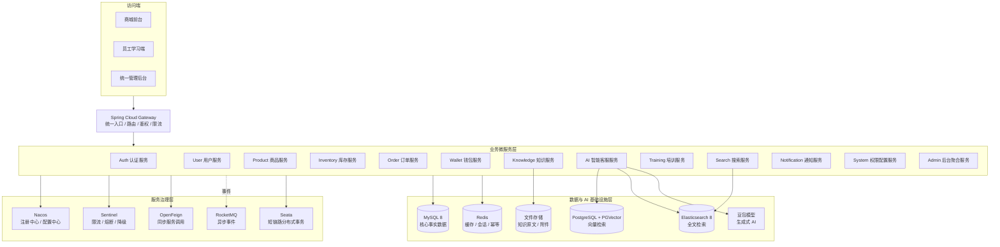
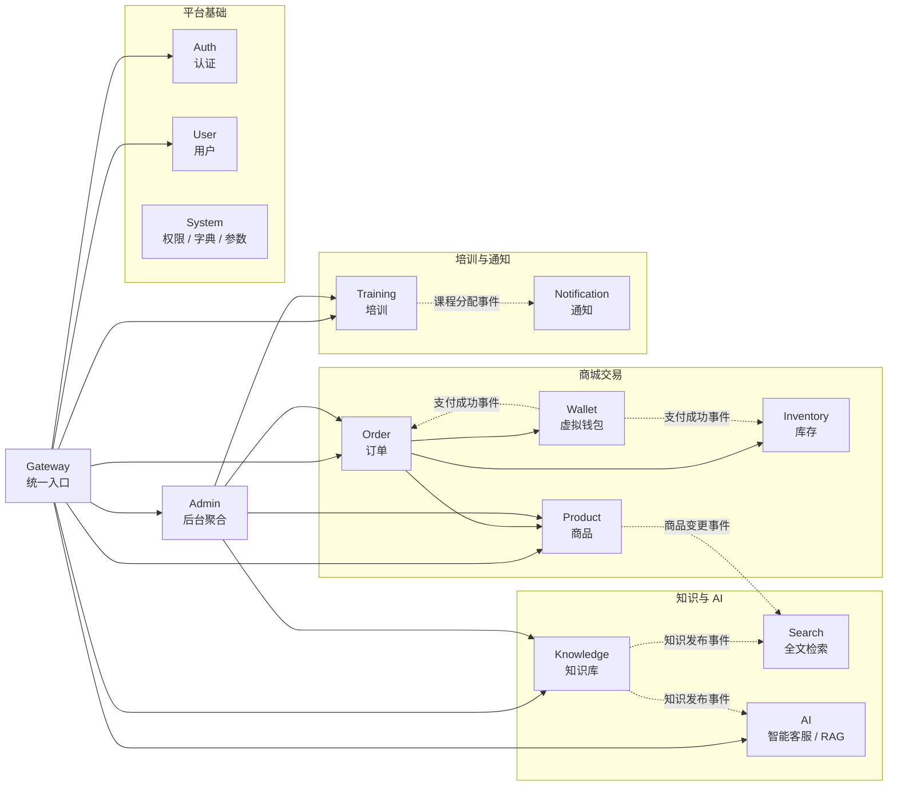
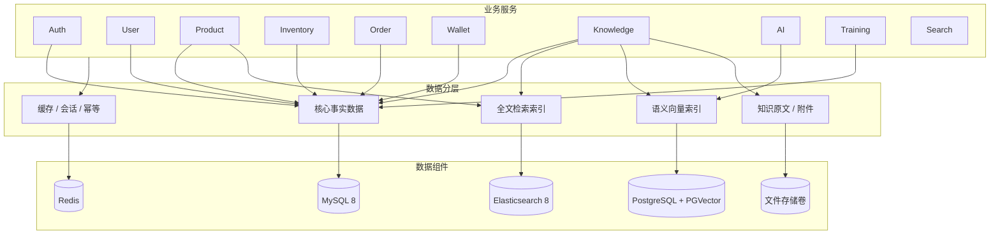
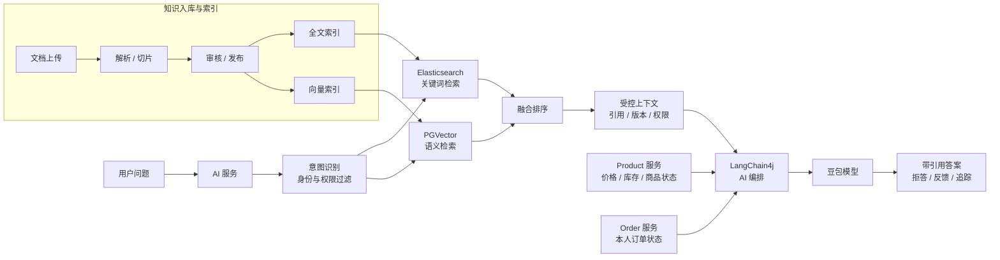
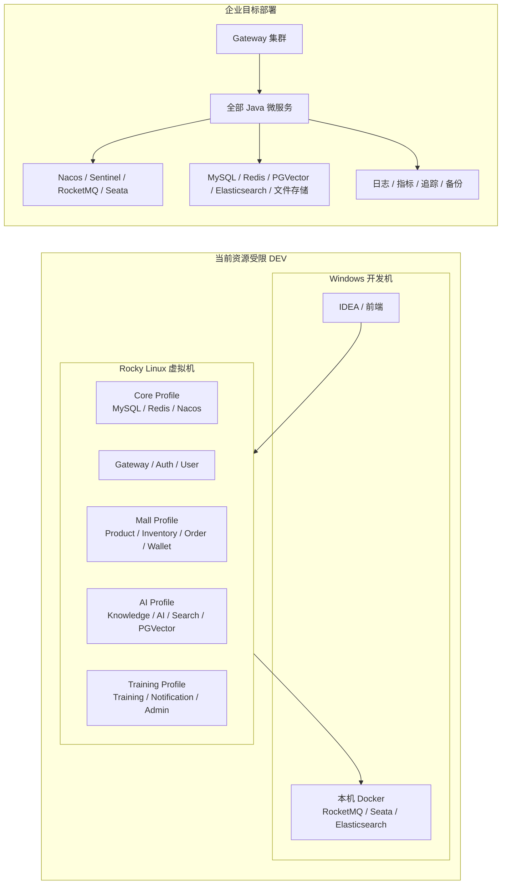

# 粤港甄选跨境智汇 AI 知识库系统企业级汇报 PPT 设计脚本

> 适用场景：企业管理层、技术负责人、业务负责人联合汇报。  
> 汇报定位：说明系统建设背景、业务价值、总体架构、关键技术选型、架构设计必要性和实施路线。  
> 项目基线：Java 25、Spring Boot 4.0.7、Spring Cloud Alibaba、Maven 多模块、RAG、豆包大模型、PGVector、Elasticsearch、Docker Compose。

---

## 01 封面

### 页面标题

粤港甄选跨境智汇 AI 知识库系统建设方案

### 页面内容

- 企业级分布式系统架构设计
- 在线商城、知识库、AI 客服、员工培训、统一后台一体化建设
- 技术基线：Java 25 + Spring Boot 4 + Spring Cloud Alibaba + RAG

### 讲解词

本项目不是单一商城，也不是单一 AI 问答系统，而是围绕跨境电商业务构建的综合数字化平台。系统同时支撑商品交易、知识沉淀、智能客服、员工培训和后台运营管理，目标是让企业业务数据、知识资产和 AI 能力形成统一平台能力。

---

## 02 项目背景与建设痛点

### 页面标题

为什么要建设这个系统？

### 页面内容

- 商品知识、政策法规、通关流程、物流经验分散。
- 客服问题专业度高，人工响应成本高、稳定性不足。
- 新员工培训周期长，学习过程不可追踪。
- 商城、知识、订单、培训和 AI 能力缺少统一平台。
- 企业需要可扩展、可审计、可部署、可持续演进的系统底座。

### 讲解词

跨境电商业务的复杂点不只在商品售卖，还在政策、通关、溯源、物流和客户解释。过去这些知识分散在文档、人员经验和零散系统中，导致客服依赖人工、培训依赖师傅带、运营数据难以沉淀。因此本系统的核心价值，是把业务流程、知识资产和 AI 服务能力统一起来。

---

## 03 系统建设目标

### 页面标题

建设目标：一个平台支撑五类核心能力

### 页面内容

1. 在线商城：商品、库存、订单、虚拟钱包、模拟支付。
2. 企业知识库：文档、版本、审核、发布、全文与向量检索。
3. AI 智能客服：政策问答、通关问答、商品溯源、商品推荐。
4. 员工培训：岗位课程、闯关学习、测验、学习进度统计。
5. 统一后台：用户、权限、商品、订单、知识、AI、培训运营管理。

### 讲解词

系统不是简单把多个模块拼在一起，而是围绕企业真实运营流程设计。商城产生商品、订单和客户问题；知识库沉淀政策、流程和商品资料；AI 客服调用知识库和实时商品服务；培训系统复用知识内容进行员工学习；后台负责统一运营、权限和审计。

---

## 04 总体架构图

### 页面标题

总体架构：前端入口 + 微服务集群 + 治理组件 + 多类型数据底座

### 建议配图

```text
访问端
商城前台 / 员工学习端 / 统一管理后台
        ↓
统一入口层
Spring Cloud Gateway
        ↓
业务服务层
Auth / User / Product / Inventory / Order / Wallet
Knowledge / AI / Training / Search / Notification / Admin / System
        ↓
服务治理层
Nacos / Sentinel / OpenFeign / RocketMQ / Seata
        ↓
数据与 AI 层
MySQL / Redis / Elasticsearch / PostgreSQL + PGVector / 文件存储 / 豆包模型
```

### 讲解词

架构采用 Spring Cloud Alibaba 微服务体系。所有外部请求统一进入 Gateway，再分发到后端各业务服务。服务之间通过 OpenFeign 同步调用，通过 RocketMQ 进行异步事件解耦。核心交易数据存储在 MySQL，热点数据进入 Redis，全文检索使用 Elasticsearch，语义检索使用 PGVector，AI 生成能力通过 LangChain4j 对接豆包模型。

---

## 04-1 架构图怎么画？

### 页面标题

汇报 PPT 中建议放 5 类架构图

### 页面内容

建议不要只画一张“大而全”的图。企业汇报中可以拆成 5 张图，分别服务不同讲解目的：

| 架构图 | 放置位置 | 主要回答的问题 |
|---|---|---|
| 总体架构图 | 第 04 页 | 系统整体由哪些层组成？ |
| 微服务职责与调用图 | 第 07 页后 | 服务怎么拆？服务之间怎么协作？ |
| 数据架构图 | 第 08 页 | 数据分别存在哪里？谁是事实来源？ |
| AI/RAG 流程图 | 第 09 页 | AI 如何基于知识库回答？ |
| 部署拓扑图 | 第 22 页 | 当前 DEV 和企业部署如何落地？ |

### 讲解词

架构图不要追求一次性塞满所有细节。管理层需要先看懂系统分层和价值，技术团队再看服务边界、数据流和部署方式。因此建议按汇报节奏拆成多张图，每张图只解决一个问题。

---

## 04-2 总体架构图绘制说明

### 图名

粤港甄选跨境智汇 AI 知识库系统总体架构图

### 画法

采用从上到下的五层结构：

```text
第 1 层：访问端
商城前台 / 员工学习端 / 统一管理后台

第 2 层：统一入口层
Spring Cloud Gateway

第 3 层：业务服务层
Auth / User / Product / Inventory / Order / Wallet
Knowledge / AI / Training / Search / Notification / Admin / System

第 4 层：服务治理层
Nacos / Sentinel / OpenFeign / RocketMQ / Seata

第 5 层：数据与 AI 基础设施层
MySQL / Redis / Elasticsearch / PostgreSQL + PGVector / 文件存储 / 豆包模型
```

### 箭头规则

- 访问端统一指向 Gateway。
- Gateway 指向业务服务层。
- 业务服务层向下连接服务治理层和数据基础设施层。
- AI 服务单独连到 PGVector、Elasticsearch、Knowledge、Product 和豆包模型。
- RocketMQ 用虚线连接订单、库存、钱包、知识、搜索、通知等服务，表示异步事件。
- OpenFeign 用细实线连接服务之间的同步调用。

### PPT 视觉建议

- 每一层使用横向浅色带状区域。
- Gateway 使用醒目的中心节点。
- 业务服务用小矩形分组，不要画成复杂网状。
- 数据组件放底部，用数据库圆柱或基础设施图标。
- 同步调用用实线，异步消息用虚线，外部模型调用用高亮线。

### 可直接给制图人员的 Mermaid 草图



---

## 05 为什么选择微服务架构？

### 页面标题

架构选型：为什么不用大单体，而采用微服务？

### 页面内容

#### 选择原因

- 业务域复杂：商城、知识、AI、培训、后台职责差异大。
- 数据边界清晰：订单、钱包、库存、知识、培训需要独立治理。
- 团队可并行开发：不同模块可独立开发、测试、部署。
- 后续扩展空间大：AI、搜索、订单等模块可按负载独立扩容。

#### 好处与必要性

- 避免所有业务耦合成一个大型单体。
- 降低修改一个模块影响全系统的风险。
- 支持企业级交付、权限隔离、接口契约和独立演进。
- 便于后续从 MVP 平滑升级到完整企业部署。

### 讲解词

这个系统同时包含交易、内容、AI、培训和运营后台，如果做成单体，短期看开发简单，长期会造成模块耦合、部署困难、权限混乱和扩展成本高。微服务架构的必要性在于，它让每个业务域拥有清晰边界和独立生命周期，适合企业级持续建设。

---

## 06 Maven 多模块工程设计

### 页面标题

工程结构：主项目 → 业务副项目 → 功能子项目

### 页面内容

- 根项目：统一聚合、插件、构建规范。
- `ygh-dependencies`：企业 BOM，统一依赖版本。
- `ygh-common`：公共响应、异常、安全、Redis、MQ、测试能力。
- `ygh-platform`：Gateway、Auth。
- `ygh-applications`：用户、商品、库存、订单、钱包、知识、AI、培训等业务模块。
- 每个业务域拆分为：
  - `xxx-api`：DTO、Feign 接口、事件契约。
  - `xxx-service`：业务实现、Controller、Domain、Repository。

### 讲解词

工程采用 Maven 多模块结构，是为了把代码组织和业务边界对应起来。API 模块只放契约，Service 模块只放实现，其他服务只能依赖 API，不能依赖对方 Service。这样可以避免跨模块乱调用，也为后续接口治理、契约测试和团队并行开发打基础。

---

## 07 核心业务服务职责

### 页面标题

微服务拆分：按业务领域建立清晰责任边界

### 页面内容

| 服务 | 核心职责 |
|---|---|
| Gateway | 统一入口、路由、JWT 前置校验、限流 |
| Auth | 登录、令牌、验证码、会话 |
| User | 用户资料、地址、员工、部门岗位 |
| Product | 商品、SKU、类目、品牌、溯源、上下架 |
| Inventory | 库存锁定、确认、释放、对账 |
| Order | 购物车、订单状态机、模拟履约 |
| Wallet | 虚拟充值、模拟支付、余额流水 |
| Knowledge | 文档、版本、审核、发布、解析 |
| AI | RAG、会话、豆包调用、引用回答 |
| Training | 课程、关卡、测验、学习进度 |
| Search | 商品与知识全文检索 |
| System/Admin | 权限、字典、后台聚合、审计 |

### 讲解词

每个服务只拥有自己的业务职责和数据边界。比如订单服务不直接修改库存表，而是通过库存服务完成锁定和确认；AI 服务不能直接查询数据库或修改订单，只能通过受控工具调用业务服务。这种设计保障了系统边界、安全性和可维护性。

---

## 08 数据架构设计

### 页面标题

数据架构：一类数据一个事实来源

### 页面内容

- MySQL：订单、钱包、库存、商品、用户等核心业务事实数据。
- Redis：会话、验证码、热点缓存、幂等键、限流计数。
- Elasticsearch：商品和知识全文检索。
- PostgreSQL + PGVector：知识切片向量存储与语义检索。
- 文件卷：知识原文、附件、上传文件。

### 重要原则

- 禁止跨服务直接访问数据库。
- 禁止跨库 JOIN。
- Redis、Elasticsearch、PGVector 都不是交易事实来源。
- 派生索引必须可重建。

### 讲解词

数据架构的关键是事实数据和派生数据分离。订单、余额、库存必须以数据库为准；Redis 用于性能优化，Elasticsearch 用于关键词检索，PGVector 用于语义召回。这可以避免缓存或索引异常时影响核心交易准确性。

---

## 09 AI 与知识库架构

### 页面标题

AI 架构：RAG 让大模型回答有依据

### 知识入库流程

```text
文档上传 → 格式校验 → 解析 → 切片 → 审核 → 发布 → 全文索引 + 向量索引
```

### AI 问答流程

```text
用户问题
→ 意图识别
→ 权限过滤
→ Elasticsearch 关键词检索
→ PGVector 语义检索
→ 融合排序
→ LangChain4j 调用豆包
→ 返回带引用答案
```

### 关键控制

- 未审核、已下线、已失效知识不得进入 AI 上下文。
- 商品价格、库存、订单状态必须实时查业务服务。
- 证据不足时拒答，不允许模型臆测。
- 记录 Prompt 版本、模型版本、引用来源、耗时和反馈。

### 讲解词

系统不让大模型凭空回答，而是使用 RAG 架构。模型回答前必须先从企业知识库和商品服务中取证，回答后展示引用来源。这样既提升回答专业性，也降低政策、通关和商品信息被模型编造的风险。

---

## 10 为什么选择 LangChain4j + 豆包？

### 页面标题

AI 技术选型：企业 Java 体系下的可控 AI 编排

### 为什么选 LangChain4j？

- 与 Java/Spring 技术栈天然匹配。
- 支持 RAG、工具调用、Embedding、模型适配。
- 便于在后端服务内做权限、审计、限流和日志治理。
- 避免 AI 能力游离在主业务系统之外。

### 为什么选豆包模型？

- 中文能力和对话体验适合客服与培训场景。
- 支持 OpenAI-compatible 接口，便于通过适配层接入。
- 可服务政策问答、商品推荐、知识解释等业务场景。

### 好处与必要性

- AI 客服不能只是聊天窗口，必须嵌入企业知识、商品和权限体系。
- 使用 Java 后端统一编排，更利于企业审计、安全和长期维护。

### 讲解词

AI 不是独立外挂，而是企业业务系统的一部分。选择 LangChain4j，是为了让 AI 能力进入 Java 微服务体系，和权限、日志、审计、限流、服务调用保持一致。豆包负责生成能力，LangChain4j 负责把模型、知识、工具和业务规则编排起来。

---

## 11 为什么选择 PGVector？

### 页面标题

向量检索：为什么使用 PostgreSQL + PGVector？

### 选择原因

- 适合知识切片向量存储和语义检索。
- 与关系数据库生态兼容，部署和维护成本相对可控。
- 支持在资源受限 DEV 环境中轻量运行。
- 可与 LangChain4j 集成。

### 好处与必要性

- 解决用户问法和文档写法不一致的问题。
- 支持政策、通关、商品知识的语义召回。
- 降低专用向量数据库引入成本。
- 适合当前 MVP 到企业级部署的渐进演进。

### 讲解词

传统关键词检索只能匹配文字，而语义检索能理解相近含义。跨境政策和通关问题通常表达方式很多，PGVector 可以把文档切片变成向量，提高召回质量。相比一开始就引入更重的专用向量数据库，PGVector 更适合当前阶段的成本和复杂度控制。

---

## 12 为什么选择 Elasticsearch？

### 页面标题

全文检索：为什么还需要 Elasticsearch？

### 选择原因

- 商品搜索需要关键词、分类、价格、产地、状态筛选。
- 知识搜索需要标题、正文、标签、来源、版本、时间过滤。
- 支持大规模全文检索和索引别名切换。
- 可用于索引重建、审计日志分析等场景。

### 好处与必要性

- 与 PGVector 形成关键词 + 语义的混合检索。
- 商品搜索响应更快，筛选能力更强。
- 索引可重建，不影响核心数据库事实数据。
- 支持企业后续搜索体验优化。

### 讲解词

PGVector 解决语义相似，Elasticsearch 解决关键词、过滤和排序。两者不是替代关系，而是互补关系。AI 问答时，两类检索结果融合排序，可以同时保证召回广度和关键词精确度。

---

## 13 为什么选择 Spring Cloud Alibaba？

### 页面标题

微服务治理：为什么选择 Spring Cloud Alibaba？

### 核心组件

- Nacos：注册中心和配置中心。
- Sentinel：限流、熔断、降级。
- OpenFeign：服务间同步调用。
- RocketMQ：异步事件消息。
- Seata：必要的短链路分布式事务。

### 选择原因

- 与 Spring Cloud 体系集成度高。
- 适合 Java 企业级微服务治理。
- 覆盖注册、配置、流量、消息、事务等核心能力。
- 对国内企业部署和运维生态更友好。

### 讲解词

微服务拆开以后，最大挑战不是写服务，而是治理服务。服务发现、配置管理、限流熔断、异步事件和分布式一致性都需要体系化能力。Spring Cloud Alibaba 提供了完整治理组件，能够支撑本项目从开发演示到企业部署的演进。

---

## 14 为什么选择 Nacos？

### 页面标题

服务注册与配置：Nacos 的作用

### 为什么选？

- 服务实例动态注册和发现。
- 不同环境配置集中管理。
- 支持 DEV、SIT、UAT、PROD namespace 隔离。
- 避免配置写死在代码中。

### 好处与必要性

- 服务扩缩容后，调用方自动发现实例。
- 中间件地址、开关、限流参数可集中调整。
- 生产配置和开发配置分离。
- 避免把密码、IP、环境参数固化到代码。

### 讲解词

Nacos 解决两个问题：服务在哪里，配置是什么。微服务数量增加后，如果靠手工配置地址，会很快失控。Nacos 让服务注册和配置管理统一起来，也为多环境部署和配置审计提供基础。

---

## 15 为什么选择 Sentinel？

### 页面标题

流量治理：为什么必须有限流、熔断和降级？

### 适用场景

- 登录接口防暴力请求。
- AI 接口防模型调用过载。
- 上传接口防大流量冲击。
- 商品搜索、订单提交防瞬时高峰。
- 依赖异常时快速降级。

### 好处与必要性

- 防止单个接口拖垮整个系统。
- 外部模型或搜索服务异常时保护主链路。
- 让系统在压力下有明确退化策略。
- 提升企业系统稳定性。

### 讲解词

AI、搜索、上传和订单都是高风险入口。如果没有限流和熔断，一个异常流量就可能导致服务雪崩。Sentinel 的作用是让系统知道什么时候该拒绝、什么时候该降级、什么时候该保护自己。

---

## 16 为什么选择 RocketMQ？

### 页面标题

异步事件：RocketMQ 让核心流程解耦

### 典型事件

- 订单创建 → 通知库存锁定、通知服务。
- 支付成功 → 订单更新、库存确认、消息通知。
- 知识发布 → 搜索索引、向量索引构建。
- 课程分配 → 站内消息通知。
- 商品变更 → 搜索索引增量更新。

### 好处与必要性

- 降低同步调用链长度。
- 支持失败重试和死信处理。
- 适合订单、库存、索引、通知等异步流程。
- 提升系统扩展性和抗波动能力。

### 讲解词

不是所有事情都应该在一次 HTTP 请求里完成。比如知识发布后建索引、订单支付后通知和对账，都可以通过消息异步处理。RocketMQ 让核心交易链路更短，也让失败任务可以重试和追踪。

---

## 17 为什么选择 Redis？

### 页面标题

缓存与幂等：Redis 提升性能与安全边界

### 使用场景

- 登录会话、令牌黑名单。
- 验证码和短期安全状态。
- 商品、类目、热点政策缓存。
- 写接口幂等键。
- 限流计数。
- 短期分布式锁。

### 好处与必要性

- 降低数据库压力。
- 提升热点数据访问速度。
- 支撑防重复提交和防重复扣款。
- 支撑安全状态快速判断。

### 讲解词

Redis 在本系统中不是事实数据库，而是性能和安全辅助组件。比如支付、充值、下单都要防重复提交，Redis 可以存放短期幂等键；登录和验证码也需要短生命周期状态，这些都适合 Redis。

---

## 18 为什么选择 MySQL 8？

### 页面标题

核心交易数据：MySQL 作为事实来源

### 承载数据

- 用户、地址、权限。
- 商品、库存、订单。
- 钱包余额、流水。
- 知识元数据、培训进度。
- 审核记录、业务状态机。

### 好处与必要性

- 关系模型成熟，事务能力稳定。
- 适合订单、钱包、库存等强一致业务。
- 便于审计、对账、报表和数据治理。
- 与 Flyway 迁移、MyBatis-Plus 生态匹配。

### 讲解词

订单、余额和库存不能依赖缓存或搜索引擎，它们必须有稳定的数据库事实来源。MySQL 负责核心业务真相，Redis、Elasticsearch、PGVector 都围绕它做加速或派生能力。

---

## 19 为什么选择 Java 25 + Spring Boot 4？

### 页面标题

后端技术基线：面向长期维护的现代 Java 企业栈

### 选择原因

- Java 25 LTS：长期支持，适合企业级后端。
- Spring Boot 4.0.7：当前 4.0.x 补丁版本，匹配 Spring Cloud 2025.1.x。
- Maven Wrapper：统一构建环境。
- 企业 BOM：统一依赖版本，防止模块自行升级。

### 好处与必要性

- 降低长期维护风险。
- 保持企业技术栈一致性。
- 支持容器化和 CI/CD。
- 为微服务、AI 编排、接口治理提供稳定基础。

### 讲解词

项目选择现代 Java 技术栈，是为了保证长期维护能力和团队协作一致性。所有依赖由企业 BOM 管理，不允许每个模块自行指定版本，避免未来出现不可控的依赖冲突。

---

## 20 安全架构设计

### 页面标题

安全设计：前端体验控制 + 后端强制校验

### 页面内容

- Gateway 做基础令牌校验、路由鉴权和限流。
- 各业务服务再次校验身份、权限和数据所有权。
- RBAC：用户、角色、权限三级模型。
- JWT 支持刷新、撤销和黑名单。
- 上传文件限制格式、MIME、大小和访问权限。
- AI 上下文做敏感信息最小化。
- Secret 只通过环境变量或 Secret 文件注入。
- 关键操作记录审计日志。

### 讲解词

系统安全不能只靠前端按钮隐藏。后端每个服务都必须做权限和数据所有权校验。特别是订单、钱包、内部知识和 AI 问答，都涉及敏感业务数据，必须建立从入口到服务内部的多层安全控制。

---

## 21 业务一致性设计

### 页面标题

一致性设计：订单、钱包、库存如何保证可靠？

### 页面内容

- 金额使用 `BigDecimal` / `DECIMAL`。
- 钱包余额与流水在同一本地事务中完成。
- 库存区分可用、锁定、已售。
- 下单、支付、退款、消息消费必须幂等。
- RocketMQ 按至少一次投递设计，消费者负责去重。
- Seata 只用于必要短链路事务，避免滥用分布式事务。
- 对账机制覆盖订单、钱包、库存。

### 讲解词

商城系统最怕的是重复扣款、库存超卖和订单状态错乱。因此本架构把订单、钱包、库存作为重点治理对象。同步流程使用本地事务保障核心数据，跨服务流程通过幂等和事件最终一致来实现。

---

## 22 部署架构设计

### 页面标题

部署设计：资源受限 DEV 与企业目标部署分离

### 当前 DEV

- 虚拟机常驻：MySQL、Redis、Nacos、Gateway、Auth、User。
- 商城场景：Product、Inventory、Order、Wallet。
- AI 场景：Knowledge、AI、Search、PGVector、Elasticsearch。
- 培训场景：Training、Notification、Admin。
- 本机 Docker 按需运行 RocketMQ、Seata、Elasticsearch。

### 企业目标

- 所有 Java 微服务和中间件部署在服务器。
- 支持完整 Compose 清单。
- 配置、Secret、监控、备份、健康检查齐备。

### 讲解词

当前开发环境资源有限，所以采用场景化 profile 分批启动，保证能开发和演示。但企业目标部署仍然保留完整服务器部署方案，不能把资源受限开发环境当作生产容量证明。

---

## 23 可观测性与运维设计

### 页面标题

可观测性：系统上线后如何发现问题？

### 页面内容

- JVM CPU、内存、GC、线程。
- HTTP QPS、P95、P99、错误率。
- MySQL 慢 SQL、连接池、锁等待。
- Redis 命中率、慢命令、内存。
- RocketMQ 积压、失败、死信。
- Elasticsearch 查询耗时、索引失败。
- PGVector 检索耗时、召回数量。
- AI 首字时间、完整响应、Token 用量、模型错误。

### 讲解词

企业系统不仅要能跑，还要能观测。尤其 AI 问答链路涉及检索、重排、模型调用和流式响应，必须记录每一步耗时和异常，这样出现问题时才能定位是模型慢、检索差、知识缺失还是服务异常。

---

## 24 测试与质量门禁

### 页面标题

质量保障：从单元测试到端到端验收

### 页面内容

- 单元测试：状态机、金额、库存、权限、Prompt 模板。
- 集成测试：MySQL、Redis、RocketMQ、PGVector、Elasticsearch。
- 契约测试：Feign API、OpenAPI、事件 Schema。
- 端到端测试：登录、充值下单、知识发布问答、培训闯关。
- 安全测试：认证、越权、注入、上传、Secret。
- 部署验证：健康检查、Nacos 注册、Gateway 可达性。

### 讲解词

系统交付不能只看页面是否能点通。每个接口必须同步 OpenAPI、错误码、权限码和测试证据。尤其订单、钱包、库存、AI 引用、知识审核这类核心能力，必须通过自动化测试和端到端验证。

---

## 25 CI/CD 交付流程

### 页面标题

持续交付：从代码提交到企业发布

### 页面内容

```text
提交代码
 → 格式与静态检查
 → 单元测试
 → Maven verify
 → 依赖与 Secret 扫描
 → 构建镜像
 → SIT 部署
 → 接口/契约/E2E 测试
 → UAT 验收
 → 正式发布审批
```

### 讲解词

企业级交付必须建立流水线。代码提交后，先经过构建、测试和安全扫描，再生成固定版本镜像。部署到测试环境后继续执行接口、契约和端到端测试，最后才进入 UAT 和正式发布审批。

---

## 26 项目实施路线

### 页面标题

实施计划：MVP 先跑通，企业能力持续完善

### 四天 MVP

- D1：工程骨架、Gateway、认证、用户、基础组件。
- D2：商品、库存、订单、钱包、文档入库。
- D3：知识、AI、培训、搜索、后台关键接口。
- D4：权限、幂等、异常、联调、部署和演示。

### 完整企业交付

- 第 1 周：需求与架构确认。
- 第 2 周：工程与基础设施。
- 第 3-5 周：商城主链路。
- 第 4-7 周：知识与 AI。
- 第 6-8 周：培训与后台。
- 第 9-10 周：联调、安全、性能、治理。
- 第 11-12 周：UAT 与交付。

### 讲解词

四天目标是完成可演示 MVP 和企业工程骨架，不等于完整生产级系统。企业级完整交付需要经过需求确认、开发、联调、安全、性能、UAT 和运维交付，预计按 10 到 12 周推进更合理。

---

## 27 架构价值总结

### 页面标题

架构价值：为什么这个方案适合企业长期建设？

### 页面内容

- 业务价值：支撑商城、知识、AI、培训、后台一体化。
- 技术价值：微服务边界清晰，支持独立开发与扩展。
- 数据价值：知识、商品、订单、培训数据形成企业资产。
- AI 价值：RAG + 实时业务工具，减少模型幻觉。
- 安全价值：RBAC、审计、限流、Secret 管理、数据隔离。
- 运维价值：容器化、健康检查、监控、备份、CI/CD。
- 演进价值：MVP 可快速演示，完整架构可持续扩展。

### 讲解词

本方案的核心不是堆技术，而是用合适的架构承接企业真实业务复杂度。微服务保证业务边界，RAG 保证 AI 可信，数据分层保证交易可靠，治理体系保证可运维和可交付。

---

## 28 结束页

### 页面标题

建设结论

### 页面内容

本系统将跨境电商业务、企业知识资产、AI 客服能力和员工培训体系统一到一个可扩展、可审计、可部署的企业级平台中。

### 讲解词

通过本系统，企业可以从业务靠人工经验驱动，逐步升级为业务流程数字化、知识资产结构化、AI 服务可控化、员工培训可追踪化的综合平台能力。这也是本项目架构设计的根本目标。

---

## 附录 A：微服务职责与调用图怎么画

### 图名

业务微服务职责与协作关系图

### 适合放在

第 07 页“核心业务服务职责”之后。

### 画法

将服务按业务域分成 5 组：

| 分组 | 服务 | 说明 |
|---|---|---|
| 平台基础 | Gateway、Auth、User、System | 入口、认证、用户、权限 |
| 商城交易 | Product、Inventory、Order、Wallet | 商品、库存、订单、虚拟支付 |
| 知识与 AI | Knowledge、AI、Search | 文档、检索、RAG、智能客服 |
| 培训运营 | Training、Notification | 课程、任务、通知 |
| 后台管理 | Admin | 跨域只读聚合与运营看板 |

### 箭头重点

- Gateway 指向所有业务服务，表示统一入口。
- Order 同步调用 Product、Inventory、Wallet，表示下单、库存、支付协作。
- Knowledge 发布事件到 Search 和 AI，表示索引构建。
- Training 发布事件到 Notification，表示学习任务通知。
- Admin 调用多个只读接口，表示后台聚合，不直接访问业务数据库。

### Mermaid 草图



### 讲解词

这张图重点说明服务不是随意拆分，而是按业务领域拆分。商城交易、知识 AI、培训运营都有各自边界，后台只做聚合查询，不越过服务边界直接操作其他服务数据库。

---

## 附录 B：数据架构图怎么画

### 图名

企业数据分层与事实来源架构图

### 适合放在

第 08 页“数据架构设计”。

### 画法

采用三层结构：

```text
上层：业务服务
Auth / User / Product / Inventory / Order / Wallet / Knowledge / AI / Training / Search

中层：数据类型
事实数据 / 缓存数据 / 全文索引 / 向量索引 / 文件附件

底层：数据组件
MySQL / Redis / Elasticsearch / PostgreSQL + PGVector / 文件存储
```

### 关键标注

- MySQL 标注：核心事实来源。
- Redis 标注：缓存、会话、幂等，不作为交易事实。
- Elasticsearch 标注：可重建全文索引。
- PGVector 标注：可重建向量索引。
- 文件存储标注：知识原文和附件。

### Mermaid 草图



### 讲解词

这张图要讲清楚一个原则：核心业务事实只在 MySQL，Redis、Elasticsearch 和 PGVector 都是辅助能力或派生索引。这样即使缓存失效、索引损坏，也可以从事实数据恢复。

---

## 附录 C：AI/RAG 流程图怎么画

### 图名

AI 智能客服 RAG 问答流程图

### 适合放在

第 09 页“AI 与知识库架构”。

### 画法

从左到右画一条问答主链路，再在下方画知识入库链路。

### 主链路

```text
用户问题
→ AI 服务
→ 意图识别与权限过滤
→ 关键词检索 Elasticsearch
→ 语义检索 PGVector
→ 融合排序
→ 受控上下文
→ LangChain4j
→ 豆包模型
→ 带引用答案
```

### 知识入库链路

```text
文档上传
→ 解析切片
→ 审核发布
→ 全文索引
→ 向量索引
```

### Mermaid 草图



### 讲解词

这张图要突出 AI 回答不是模型直接生成，而是先检索、再排序、再带着受控上下文生成。商品价格、库存、订单状态不从模型记忆里拿，而是通过业务服务实时查询。

---

## 附录 D：部署拓扑图怎么画

### 图名

资源受限 DEV 与企业目标部署拓扑图

### 适合放在

第 22 页“部署架构设计”。

### 画法

建议画成左右对比：

| 左侧 | 右侧 |
|---|---|
| 当前资源受限 DEV | 企业目标部署 |
| Windows 开发机 + Rocky Linux 虚拟机 | 服务器完整部署 |
| 按场景 profile 启停 | 全组件服务器部署 |
| 本机 Docker 承载重型依赖 | 统一服务器 Compose / 后续 K8s 演进 |

### 当前 DEV 拓扑重点

- Windows 开发机：IDEA、前端、本机 Docker。
- 本机 Docker：RocketMQ、Seata、Elasticsearch 按需运行。
- Rocky Linux VM：MySQL、Redis、Nacos、PGVector、核心 Java 服务。
- 场景 profile：core、mall、ai-apps、training。

### 企业目标部署重点

- Gateway 与全部 Java 微服务部署在服务器。
- MySQL、Redis、Nacos、RocketMQ、Seata、PGVector、Elasticsearch 在服务器统一编排。
- Secret、配置、监控、备份、健康检查独立治理。

### Mermaid 草图



### 讲解词

这张图要明确区分当前开发演示能力和企业目标部署能力。当前 DEV 是资源受限下的场景化运行方案，不代表生产容量；企业目标部署才是完整服务器部署方案。

---

## 附录 E：PPT 架构图统一视觉规范

### 配色建议

- 访问端：浅蓝色。
- 网关入口：深蓝色或品牌主色。
- 业务服务：浅绿色或浅青色。
- 服务治理：浅紫色。
- 数据组件：浅橙色。
- AI 与模型：金色或高亮色。
- 安全与审计：灰色或红色强调。

### 图形建议

- 服务使用圆角矩形。
- 数据库使用圆柱体。
- 外部模型使用云形或独立高亮矩形。
- 同步调用使用实线箭头。
- 异步消息使用虚线箭头。
- 数据写入使用粗实线。
- 派生索引使用虚线或细线。

### 排版建议

- 一张图最多表达一个主题。
- 每张图控制在 8 到 15 个主要节点。
- 不要在管理层汇报图里画所有类名、表名和接口名。
- 技术评审版本可以保留 Mermaid 或 Visio 源图。
- 企业汇报版本优先使用简洁图标、分层色块和关键箭头。

### 讲解词

架构图的目标不是证明系统复杂，而是让听众迅速理解系统为什么这样设计。汇报版架构图要清晰表达分层、边界、数据流和价值，细节可以放到技术评审材料中。
