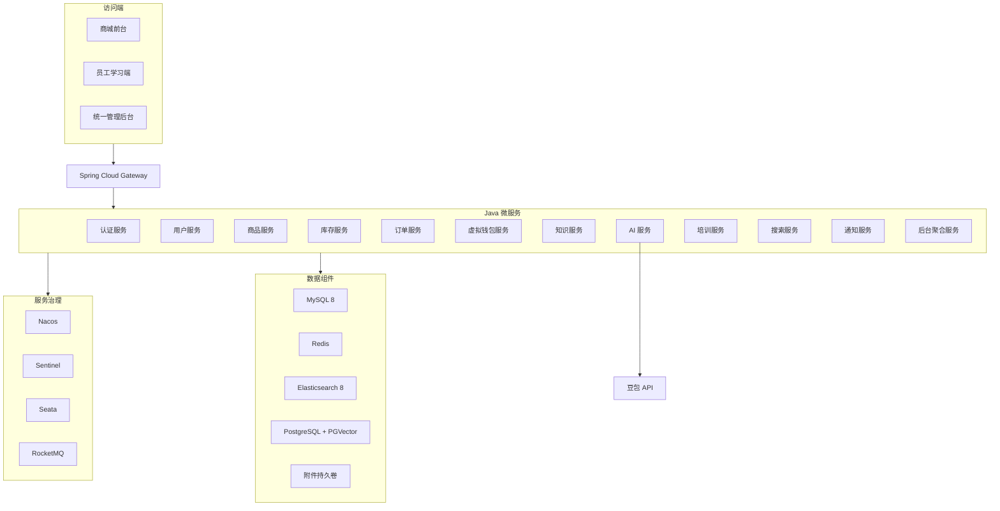
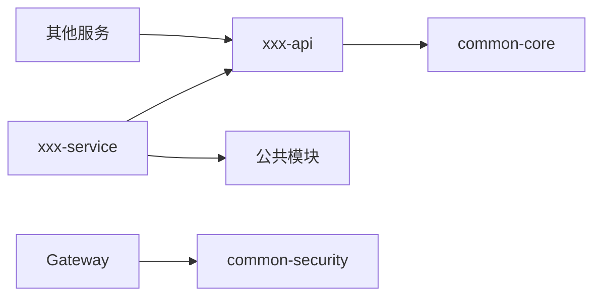
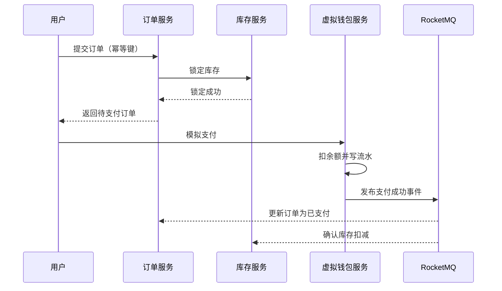
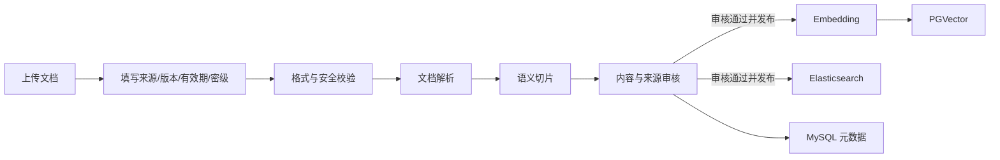
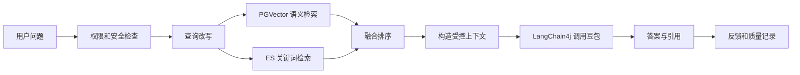
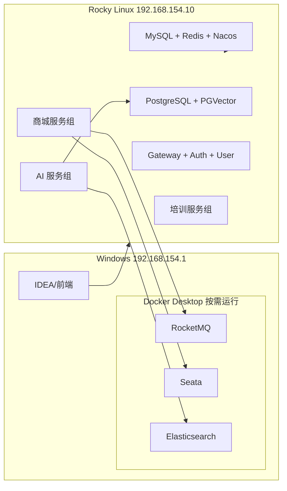

# 粤港甄选跨境智汇 AI 知识库系统——项目设计架构文档

> 文档版本：V1.3（评审稿）  
> 编制日期：2026-07-10  
> 开发语言：Java 25 LTS  
> 架构形态：Spring Cloud Alibaba 分布式微服务  
> 部署要求：当前 DEV 最大化利用虚拟机并按场景切换；本机 Docker 仅承载重型依赖；企业目标仍为服务器完整部署

## 1. 架构目标

本架构需要同时支撑在线商城、企业知识库、AI 智能客服、员工培训和统一管理后台，并满足以下目标：

1. 严格使用 Maven 多模块聚合工程。
2. 建立“主项目 → 业务副项目 → 功能子项目”的清晰层级。
3. 每个功能服务能够独立开发、测试、构建、部署和扩缩容。
4. 所有 Java 可运行子项目遵循标准 Maven 目录格式。
5. 商品、订单、用户、知识、AI 和培训按业务领域拆分，禁止形成一个大型单体工程。
6. 指定的技术栈必须全部纳入系统设计。
7. 当前资源受限 DEV 中，Java 服务与轻量核心组件优先运行在虚拟机，重型中间件按场景运行在本机 Docker；交付物必须同时保留全部组件的服务器部署清单。
8. 四天内先完成可演示 MVP 和企业工程骨架，后续按完整企业交付计划迭代。

## 2. 强制技术栈

| 技术层次 | 技术选型 | 用途 |
|---|---|---|
| Java 运行环境 | JDK 25 LTS | 全部后端服务和 AI 编排服务 |
| 基础框架 | Spring Boot 4.0.7 | 微服务应用开发；选择当前 4.0.x 最新补丁版以匹配 Spring Cloud Alibaba 2025.1.x 官方适配范围 |
| 微服务体系 | Spring Cloud + Spring Cloud Alibaba | 服务治理与微服务集成 |
| API 网关 | Spring Cloud Gateway | 统一入口、路由、鉴权、限流 |
| 注册与配置 | Nacos | 服务发现、配置管理 |
| 流量治理 | Sentinel | 限流、熔断、降级 |
| 分布式事务 | Seata | 必要的短链路分布式事务 |
| 服务调用 | OpenFeign | 微服务同步调用 |
| 消息队列 | RocketMQ | 订单、库存、审核、索引、通知事件 |
| 关系数据库 | MySQL 8 | 用户、商品、订单、库存、钱包、培训等核心数据 |
| 缓存 | Redis | 热点缓存、会话、幂等、限流、分布式锁 |
| 全文检索 | Elasticsearch 8 | 商品与知识全文检索、日志分析 |
| 向量数据库 | PostgreSQL + PGVector | 知识切片向量存储和语义检索 |
| AI 框架 | LangChain4j | 文档处理、RAG、模型调用和工具调用 |
| 大模型 | 豆包 Doubao 1.5 Pro | AI 客服、问答和推荐生成 |
| 容器化 | Docker + Docker Compose | 资源受限 DEV 分层编排；企业目标为服务器完整部署 |
| 构建管理 | Maven + Maven Wrapper | 多模块构建和版本治理 |

### 2.1 目标版本基线

| 组件 | 目标版本 | 依据与说明 |
|---|---|---|
| JDK | 25 LTS | OpenJDK 25 已于 2025-09-16 GA；Oracle 将 Java 25 列为 LTS |
| Spring Boot | 4.0.7 | 当前 4.0.x 最新补丁版；保留 JDK 25 基线并降低与 Alibaba 体系的版本偏差 |
| Spring Framework | 由 Spring Boot 4.0.7 BOM 管理 | 禁止子模块自行覆盖 |
| Spring Cloud | 2025.1.2 | 官方支持 Spring Boot 4.0.x，并包含当前 Oakwood 服务版本修复 |
| Spring Cloud Alibaba | 2025.1.0.0 | 官方 2025.1.x 分支适配 Spring Boot 4.0.x、Spring Cloud 2025.1.x；发布基线为 Boot 4.0.0、Cloud 2025.1.0 |
| Nacos | 3.1.1 | Spring Cloud Alibaba 2025.1.0.0 配套版本 |
| Sentinel | 1.8.9 | Spring Cloud Alibaba 2025.1.0.0 配套版本 |
| RocketMQ | 5.3.1 | Spring Cloud Alibaba 2025.1.0.0 配套版本 |
| Seata | 2.5.0 | Spring Cloud Alibaba 2025.1.0.0 配套版本 |
| MySQL | 8.x，锁定具体补丁版本 | 核心交易数据；升级前执行兼容性和回滚验证 |
| Elasticsearch | 8.x，锁定具体补丁版本 | 商品、知识全文检索和日志分析 |
| LangChain4j | 实施时锁定经验证版本 | 必须通过 JDK 25、Spring Boot 4.0.7、豆包和 PGVector 集成测试 |

### 2.2 Spring 版本兼容性门禁

本项目经评审将目标基线调整为 **JDK 25 LTS + Spring Boot 4.0.7**。该组合落入 Spring Cloud Alibaba 2025.1.x 声明的 Boot 4.0.x 适配范围，但仍不能在未实测前描述为“完全兼容”：

1. JDK 25 保持不变，所有依赖仍必须在 JDK 25 下完成编译、测试、反射和容器验证。
2. Spring Cloud 官方确认 `2025.1.2` 支持 Spring Boot 4.0.x。
3. Spring Cloud Alibaba `2025.1.0.0` 声明适配 Spring Boot 4.0.x、Spring Cloud 2025.1.x；其发布表中的精确基线仍是 Boot 4.0.0 + Cloud 2025.1.0，因此使用 4.0.7 + 2025.1.2 时仍需执行项目兼容性回归。
4. 项目必须先建立独立兼容性验证分支，验证 Nacos 注册/配置、Gateway、Sentinel、RocketMQ、Seata、OpenFeign、Actuator 和 Jackson 3 序列化。
5. 不得通过关闭 `spring.cloud.compatibility-verifier` 掩盖版本冲突。
6. 只有兼容性测试全部通过后，才允许把该组合合入主分支并固化到企业 BOM。
7. 如果兼容性验证失败，应先定位具体组件冲突；未经项目负责人批准，不得继续降级到旧主版本、关闭兼容性检查或使用 Snapshot 版本进入正式环境。

### 2.3 JDK 25 使用约束

1. 编译、单元测试、集成测试、CI 和容器运行时统一使用同一发行版、同一补丁级别的 JDK 25。
2. Maven Compiler 使用 `<release>25</release>`，禁止只修改本机 `JAVA_HOME` 而不修改构建基线。
3. 正式业务代码不得使用 Preview 或 Incubator 特性；如需研究，必须放在独立实验模块中。
4. 依赖库必须在 JDK 25 下完成编译、测试、反射访问和序列化验证。
5. Docker 基础镜像必须固定到 JDK 25 的明确版本或 digest，禁止使用 `latest`。

## 3. 总体架构



## 4. Maven 项目拆分方案

### 4.1 拆分原则

采用一个 Git 单仓库和一个 Maven 根聚合工程。

- **主项目**：`yuegang-zhihui-ai`，统一管理全部副项目、依赖、插件和构建流程。
- **业务副项目**：`ygh-applications`，承载所有业务功能聚合项目。
- **功能聚合项目**：如 `ygh-product`、`ygh-order`、`ygh-knowledge`。
- **API 子项目**：如 `ygh-product-api`，只放跨服务接口契约、DTO 和事件定义。
- **Service 子项目**：如 `ygh-product-service`，放可运行的 Spring Boot 服务。

`packaging=pom` 的聚合项目按照 Maven 规范不创建无意义的 `src` 目录；所有可编译 JAR 子项目都必须具备独立 `pom.xml` 和标准 `src` 目录。

### 4.2 完整项目目录

```text
yuegang-zhihui-ai/                         # Maven 根项目、Git 仓库根目录
├─ pom.xml                                 # packaging=pom，聚合全部模块
├─ mvnw
├─ mvnw.cmd
├─ .mvn/
├─ .gitignore
├─ README.md
│
├─ ygh-dependencies/                       # 企业依赖 BOM
│  └─ pom.xml                              # packaging=pom
│
├─ ygh-common/                             # 公共能力副项目
│  ├─ pom.xml                              # packaging=pom
│  ├─ ygh-common-core/
│  ├─ ygh-common-web/
│  ├─ ygh-common-security/
│  ├─ ygh-common-mybatis/
│  ├─ ygh-common-redis/
│  ├─ ygh-common-mq/
│  └─ ygh-common-test/
│
├─ ygh-platform/                           # 平台入口副项目
│  ├─ pom.xml                              # packaging=pom
│  ├─ ygh-gateway/
│  └─ ygh-auth-service/
│
├─ ygh-applications/                       # 业务副项目
│  ├─ pom.xml                              # packaging=pom
│  │
│  ├─ ygh-user/                            # 用户功能聚合项目
│  │  ├─ pom.xml                           # packaging=pom
│  │  ├─ ygh-user-api/
│  │  └─ ygh-user-service/
│  │
│  ├─ ygh-product/                         # 商品功能聚合项目
│  │  ├─ pom.xml
│  │  ├─ ygh-product-api/
│  │  └─ ygh-product-service/
│  │
│  ├─ ygh-inventory/
│  │  ├─ pom.xml
│  │  ├─ ygh-inventory-api/
│  │  └─ ygh-inventory-service/
│  │
│  ├─ ygh-order/
│  │  ├─ pom.xml
│  │  ├─ ygh-order-api/
│  │  └─ ygh-order-service/
│  │
│  ├─ ygh-wallet/                          # 虚拟资金，不接真实支付
│  │  ├─ pom.xml
│  │  ├─ ygh-wallet-api/
│  │  └─ ygh-wallet-service/
│  │
│  ├─ ygh-knowledge/
│  │  ├─ pom.xml
│  │  ├─ ygh-knowledge-api/
│  │  └─ ygh-knowledge-service/
│  │
│  ├─ ygh-ai/
│  │  ├─ pom.xml
│  │  ├─ ygh-ai-api/
│  │  └─ ygh-ai-service/
│  │
│  ├─ ygh-training/
│  │  ├─ pom.xml
│  │  ├─ ygh-training-api/
│  │  └─ ygh-training-service/
│  │
│  ├─ ygh-search/
│  │  ├─ pom.xml
│  │  ├─ ygh-search-api/
│  │  └─ ygh-search-service/
│  │
│  ├─ ygh-notification/
│  │  ├─ pom.xml
│  │  ├─ ygh-notification-api/
│  │  └─ ygh-notification-service/
│  │
│  ├─ ygh-system/                         # 权限与系统配置事实服务
│  │  ├─ pom.xml
│  │  ├─ ygh-system-api/
│  │  └─ ygh-system-service/
│  │
│  └─ ygh-admin/
│     ├─ pom.xml
│     ├─ ygh-admin-api/
│     └─ ygh-admin-service/
│
├─ ygh-deploy/                             # 部署副项目
│  ├─ compose/
│  ├─ mysql/
│  ├─ nacos/
│  ├─ monitoring/
│  └─ scripts/
│
├─ ygh-tests/                              # 跨服务测试副项目
│  ├─ ygh-contract-tests/
│  ├─ ygh-e2e-tests/
│  └─ ygh-performance-tests/
│
└─ docs/
   ├─ 需求规格说明书.md
   ├─ 项目设计架构文档.md
   ├─ api/
   ├─ database/
   └─ daily/
```

### 4.3 可运行子项目标准目录

所有 `*-service`、`ygh-gateway` 和其他可运行 Java 子项目必须采用以下格式：

```text
ygh-product-service/
├─ pom.xml
├─ Dockerfile
└─ src/
   ├─ main/
   │  ├─ java/
   │  │  └─ com/yuegang/zhihui/product/
   │  │     ├─ ProductApplication.java
   │  │     ├─ interfaces/
   │  │     │  ├─ controller/
   │  │     │  ├─ request/
   │  │     │  └─ response/
   │  │     ├─ application/
   │  │     │  ├─ command/
   │  │     │  ├─ query/
   │  │     │  └─ service/
   │  │     ├─ domain/
   │  │     │  ├─ model/
   │  │     │  ├─ service/
   │  │     │  ├─ repository/
   │  │     │  └─ event/
   │  │     └─ infrastructure/
   │  │        ├─ persistence/
   │  │        ├─ mq/
   │  │        ├─ cache/
   │  │        ├─ search/
   │  │        └─ client/
   │  └─ resources/
   │     ├─ application.yml
   │     ├─ mapper/
   │     └─ db/migration/
   └─ test/
      └─ java/com/yuegang/zhihui/product/
         ├─ unit/
         ├─ integration/
         └─ contract/
```

### 4.4 API 子项目标准目录

```text
ygh-product-api/
├─ pom.xml
└─ src/
   ├─ main/
   │  └─ java/com/yuegang/zhihui/product/api/
   │     ├─ client/                         # Feign 接口
   │     ├─ dto/                            # 跨服务 DTO
   │     ├─ event/                          # 对外事件契约
   │     └─ enums/
   └─ test/
      └─ java/com/yuegang/zhihui/product/api/
```

API 模块不得包含 Controller、数据库 Entity、Mapper、业务实现或启动类。

## 5. 模块依赖规则



必须遵循以下规则：

1. `xxx-service` 可以依赖自己的 `xxx-api` 和公共模块。
2. 其他服务只能依赖目标服务的 `xxx-api`，不能依赖目标 `xxx-service`。
3. API 模块只允许依赖轻量公共核心模块。
4. 公共模块不得反向依赖业务模块。
5. 不允许形成循环依赖。
6. 不允许通过复制 DTO 绕过 API 契约模块。
7. 公共模块只承载真正跨领域的技术能力，不承载商品、订单等业务逻辑。

## 6. Maven 规范

### 6.1 坐标规范

```xml
<groupId>com.yuegang.zhihui</groupId>
<artifactId>ygh-{domain}-{api|service}</artifactId>
<version>${revision}</version>
```

Java 包名统一为：

```text
com.yuegang.zhihui.{domain}.{layer}
```

### 6.2 根 POM 职责

根 `pom.xml` 只负责：

1. 聚合副项目。
2. 定义 `${revision}`、编码、JDK 25、`maven.compiler.release=25` 和 Maven 版本。
3. 根 POM 不直接导入以自身为父的子 BOM，避免 Maven 模型解析环；各副项目聚合 POM 统一导入 `ygh-dependencies` BOM，功能子项目继承该版本治理。
4. 统一 `pluginManagement`。
5. 配置 Enforcer、Compiler、Surefire、Failsafe、JaCoCo 和静态检查。
6. 禁止动态版本、重复依赖和未声明版本。
7. 使用 Maven Enforcer 校验实际运行 JDK 为 25，并阻止低版本 Maven 执行构建。

根 POM 不放业务依赖和业务代码。

### 6.3 BOM 职责

`ygh-dependencies/pom.xml` 统一管理：

- Spring Boot Dependencies。
- Spring Cloud Dependencies。
- Spring Cloud Alibaba Dependencies。
- LangChain4j。
- MyBatis 或 MyBatis-Plus。
- MySQL、PostgreSQL、Redis、RocketMQ 和 Elasticsearch 客户端。
- 测试、日志、序列化和工具库。

子项目不得自行覆盖 Spring 体系版本；需要升级时必须修改 BOM 并执行全量回归。

### 6.4 JDK 25 构建配置

根 POM 至少包含以下构建基线：

```xml
<properties>
    <java.version>25</java.version>
    <maven.compiler.release>25</maven.compiler.release>
    <project.build.sourceEncoding>UTF-8</project.build.sourceEncoding>
</properties>
```

同时通过 `.mvn/jvm.config`、Maven Toolchains 或 CI 镜像确保 Maven 自身运行在 JDK 25。所有开发人员、CI 和容器不得混用 JDK 17、21、25 编译同一版本。

### 6.5 构建命令

```bash
# 全量构建
./mvnw clean verify

# 构建单个服务及其依赖
./mvnw -pl ygh-applications/ygh-product/ygh-product-service -am clean verify

# 仅运行单元测试
./mvnw test

# 运行集成测试
./mvnw verify -Pintegration
```

## 7. 微服务职责

| 服务 | 核心职责 | 私有数据 |
|---|---|---|
| `ygh-gateway` | 统一路由、JWT 前置校验、限流、黑白名单、traceId | 不持有业务数据 |
| `ygh-auth-service` | 登录、令牌、验证码、密码策略、会话 | `auth_db`、Redis 会话 |
| `ygh-user-service` | 客户资料、员工资料、地址、部门岗位关系 | `user_db` |
| `ygh-product-service` | SPU/SKU、类目、品牌、价格、图片、溯源、上下架 | `product_db` |
| `ygh-inventory-service` | 可用库存、库存锁定、确认、释放和对账 | `inventory_db` |
| `ygh-order-service` | 购物车、结算、订单状态机、模拟履约 | `order_db` |
| `ygh-wallet-service` | 虚拟充值、余额、模拟支付、退款、钱包对账 | `wallet_db` |
| `ygh-knowledge-service` | 文档、版本、审核、发布、解析、切片和索引任务 | `knowledge_db`、附件卷 |
| `ygh-ai-service` | RAG、会话、豆包调用、商品工具、Prompt 和评测 | `ai_db`、PGVector |
| `ygh-training-service` | 岗位、课程、章节、关卡、测验、任务和进度 | `training_db` |
| `ygh-search-service` | 商品和知识全文检索、索引构建和重建 | Elasticsearch |
| `ygh-notification-service` | 站内信、消息模板、异步通知和失败重试 | `notification_db` |
| `ygh-system-service` | 角色、权限、授权关系、字典、参数和功能开关 | `system_db` |
| `ygh-admin-service` | 管理看板和跨域只读聚合 | 查询模型，不拥有核心交易表 |

## 8. 数据架构

### 8.1 数据所有权

每个微服务拥有自己的数据库或独立 Schema。

```text
auth-service       -> auth_db
user-service       -> user_db
product-service    -> product_db
inventory-service  -> inventory_db
order-service      -> order_db
wallet-service     -> wallet_db
knowledge-service  -> knowledge_db
ai-service         -> ai_db + pgvector
training-service   -> training_db
notification       -> notification_db
system-service     -> system_db
```

禁止事项：

1. 一个服务直接查询或更新另一个服务的表。
2. 通过跨库 JOIN 实现业务查询。
3. 在多个服务内共同维护同一张业务表。
4. 使用 Redis 或 Elasticsearch 作为订单和余额的唯一事实来源。

跨服务查询使用以下方式：

- OpenFeign 同步 API。
- RocketMQ 事件构建本地查询模型。
- Elasticsearch 建立面向搜索的派生索引。
- 后台聚合服务调用多个只读接口。

### 8.2 核心数据表

| 数据域 | 代表表 |
|---|---|
| 认证账户 | `auth_account`、`auth_credential`、`auth_refresh_token`、`auth_login_attempt` |
| 用户资料 | `user_profile`、`employee_profile`、`user_address`、`department`、`position`、`employee_position` |
| 权限系统 | `sys_role`、`sys_permission`、`sys_user_role`、`sys_role_permission`、`sys_dictionary`、`sys_parameter` |
| 商品库存 | `product_spu`、`product_sku`、`category`、`brand`、`traceability`、`inventory`、`stock_ledger` |
| 订单钱包 | `cart_item`、`trade_order`、`order_item`、`order_address_snapshot`、`wallet_account`、`wallet_ledger` |
| 知识 | `knowledge_doc`、`knowledge_version`、`knowledge_review`、`ingest_task`、`chunk_metadata` |
| AI | `ai_session`、`ai_message`、`rag_trace`、`prompt_version`、`ai_feedback`、`evaluation_case` |
| 培训 | `course`、`chapter`、`learning_gate`、`question`、`exam_attempt`、`learning_assignment`、`learning_progress` |

### 8.3 金额与库存

1. 金额使用 `DECIMAL`，禁止使用 `float` 或 `double`。
2. 钱包账户使用版本号或条件更新防止并发覆盖。
3. 余额修改和钱包流水写入位于同一本地事务。
4. 库存区分可用、锁定和已售数量。
5. 库存变更生成独立流水，能够按订单对账。
6. 下单、支付和消息消费使用业务唯一键保证幂等。

## 9. Redis 设计

### 9.1 使用场景

- 登录会话和令牌黑名单。
- 验证码和短期安全状态。
- 商品、类目和热点政策缓存。
- 写接口幂等键。
- 限流计数。
- 必要的短期分布式锁。
- 学习进度的短期上报缓冲。

### 9.2 Key 规范

```text
ygh:{env}:{service}:{business}:{identifier}
```

示例：

```text
ygh:dev:product:detail:10001
ygh:dev:auth:blacklist:{tokenId}
ygh:dev:order:idempotency:{requestId}
```

### 9.3 缓存规则

1. 使用 Cache-Aside 模式。
2. 写数据库成功后删除缓存。
3. TTL 增加随机抖动，降低缓存雪崩风险。
4. 防止缓存穿透、击穿和热点 Key。
5. 分布式锁必须设置租约并校验 owner 后释放。
6. Redis 不保存唯一的订单、钱包或库存事实数据。

## 10. 服务通信与事务

### 10.1 同步调用

使用 OpenFeign 和 Nacos 服务发现。

- 所有调用设置连接超时和读取超时。
- 只对幂等查询进行有限重试。
- 使用 Sentinel 进行限流、熔断和降级。
- 禁止形成超过三层的同步调用链。
- 降级结果必须可识别，不能伪造正常业务数据。

### 10.2 RocketMQ 事件

统一事件结构：

```json
{
  "eventId": "全局唯一ID",
  "eventType": "ORDER_CREATED",
  "eventVersion": 1,
  "occurredAt": "2026-07-10T10:00:00+08:00",
  "traceId": "调用链ID",
  "producer": "ygh-order-service",
  "businessKey": "订单号",
  "payload": {}
}
```

主要事件包括：

- `ORDER_CREATED`
- `ORDER_CANCELLED`
- `WALLET_PAYMENT_SUCCEEDED`
- `WALLET_PAYMENT_FAILED`
- `STOCK_LOCKED`
- `STOCK_RELEASED`
- `KNOWLEDGE_PUBLISHED`
- `KNOWLEDGE_OFFLINE`
- `COURSE_ASSIGNED`
- `LEARNING_TASK_OVERDUE`

消费者使用事件 ID 或业务唯一键保证幂等。消费失败进入重试，超过阈值进入死信队列并告警。

### 10.3 分布式事务

优先级如下：

1. 本地事务。
2. 本地事务 + RocketMQ 事件 + 补偿。
3. Saga/TCC 等明确补偿流程。
4. 只有确需强一致的短链路才使用 Seata。

禁止把豆包调用、Elasticsearch、PGVector、文件解析等长耗时操作放入 Seata 全局事务。

### 10.4 下单一致性流程



支付失败或订单超时时，订单服务发布取消事件，库存服务幂等释放库存。

## 11. RAG 与 AI 架构

### 11.1 知识入库链路



解析和切片用于审核预览；草稿、待审核和已驳回版本只保存在受控存储与 MySQL 元数据中，不得写入 Elasticsearch 或 PGVector。只有审核通过且处于已发布、有效状态的版本才能建立全文与向量索引。

切片必须保留：

- 文档 ID 和版本 ID。
- 标题、章节和页码。
- 知识分类和标签。
- 来源机构。
- 适用地区。
- 生效、失效日期。
- 密级和可见范围。
- 商品 ID 或课程 ID 等业务关联。

### 11.2 问答链路



### 11.3 实时业务工具

模型不能直接访问数据库。AI 服务通过经过权限控制的 Java 工具调用访问：

- 商品详情查询。
- 当前价格查询。
- 当前库存查询。
- 商品溯源查询。
- 本人订单状态查询。
- 商品推荐候选查询。

所有工具均需：

1. 参数白名单校验。
2. 用户权限和数据所有权校验。
3. 调用超时和熔断。
4. 操作日志和 traceId。
5. 写操作二次确认；首期原则上只开放只读工具。

### 11.4 AI 质量评估

建立固定黄金问题集，至少覆盖：

- 政策法规。
- 通关流程。
- 商品溯源。
- 商品推荐。
- 无答案问题。
- 过期政策。
- 权限受限内容。
- 提示词注入攻击。

评估指标包括：

- Recall@K。
- 引用正确率。
- 事实一致率。
- 无答案拒答准确率。
- 商品实时信息正确率。
- 首字响应时间。
- 完整响应时间。
- 用户满意度。

每次修改模型、Prompt、切片、Embedding 或排序策略都必须执行回归评测。

## 12. 搜索架构

Elasticsearch 8 建立独立索引：

```text
ygh-product-v1
ygh-knowledge-v1
ygh-audit-log-v1
```

索引通过别名访问：

```text
ygh-product-current
ygh-knowledge-current
```

使用新索引重建后切换别名，避免全量重建期间中断查询。

商品索引包含：

- 商品名称、卖点、类目、品牌。
- 产地、供港标签、规格。
- 当前展示价格。
- 上下架状态。
- 可搜索溯源文本。

知识索引包含：

- 标题、正文切片、分类、标签。
- 来源机构和适用地区。
- 文档版本。
- 生效和失效时间。
- 发布状态和可见范围。

## 13. 认证与安全架构

### 13.1 登录边界

- 公共商城页面允许匿名访问。
- 购物车持久化、充值、下单、订单和 AI 会话需要登录。
- 员工学习端需要员工身份。
- 管理后台需要运营或管理员角色。
- 后端使用方法级或资源级权限进行二次校验。

### 13.2 安全措施

1. Gateway 进行令牌格式校验和基础路由鉴权。
2. 各服务校验用户身份、权限和资源所有权。
3. 密码使用强散列算法。
4. 令牌支持刷新、撤销和黑名单。
5. 登录、AI、上传和管理接口配置 Sentinel 限流。
6. 上传文件限制格式、MIME、大小和访问路径。
7. 关键操作记录审计日志。
8. Secret 只在 VM 环境变量或 Secret 文件中保存。
9. 数据库和中间件端口不直接暴露到公网。
10. 日志和 AI 上下文进行敏感信息最小化。

## 14. 资源受限下的服务器优先部署方案

### 14.1 约束与决策

当前不追加高配置服务器，按以下事实设计：

| 节点 | 当前资源 | 承担角色 |
|---|---|---|
| Windows 开发机 | 16 逻辑处理器、15.2GB 内存、F 盘约 610GB 可用 | IDEA、前端、本机 Docker 重型依赖 |
| Rocky Linux 10 虚拟机 | 2 vCPU、3.5GB 内存、根分区约 12GB 可用 | 核心共享组件和按场景切换的 Java 服务组 |

本方案不追求“所有组件同时常驻”，而是保留完整微服务代码、镜像和部署清单，通过场景化 profile 分批运行。这样可以在不升级硬件的情况下完成开发和演示，但必须明确它属于资源受限 DEV，不是生产容量证明。

### 14.2 当前 DEV 组件取舍

| 位置 | 组件 | 运行方式 |
|---|---|---|
| 虚拟机常驻 | MySQL、Redis、Nacos、Gateway、Auth、User | `core` profile，尽量保持在线 |
| 虚拟机商城组 | Product、Inventory、Order、Wallet | `mall` profile，需要商城开发或演示时启动 |
| 虚拟机 AI 组 | Product、Knowledge、AI、Search | `ai-apps` profile，启动前停止商城组 |
| 虚拟机培训组 | Training、Notification、Admin | `training` profile，启动前停止无关服务 |
| 本机 Docker 商城依赖 | RocketMQ、Seata | `mall-deps` profile，仅在商城组运行时启动 |
| 虚拟机 AI 数据 | PostgreSQL 17 + PGVector 0.8.5 | `ai-data` profile，按需启动并保留数据卷 |
| 本机 Docker AI 依赖 | Elasticsearch | `ai-deps` profile，仅在 AI 组运行时启动 |
| 本机 IDEA | 当前正在修改的单个服务 | 需要断点调试时替代虚拟机中的同名实例 |

虚拟机优先承载核心数据、PGVector 和 Java 服务。本机只承载 RocketMQ、Seata、Elasticsearch 这类峰值内存较高的依赖，因为这些组件与场景服务同时放入 3.5GB 虚拟机会快速耗尽内存。PGVector 实测空载约 40MB，因此放入虚拟机更节省宿主机资源。

### 14.3 网络拓扑

已验证的开发网段：

```text
Windows VMware VMnet8:  192.168.154.1/24
VMware NAT Gateway:      192.168.154.2
Rocky Linux 服务地址:    192.168.154.10/24
Rocky Linux DHCP 地址:   当前为 192.168.154.129/24
```

虚拟机能够访问宿主机 `192.168.154.1`。本机 Docker 的端口只绑定到 VMware 网卡，并由 Windows 防火墙限制来源为 `192.168.154.0/24`。Docker 服务统一绑定固定辅助地址 `192.168.154.10`，不依赖 DHCP 租约。



虚拟机访问宿主机 RocketMQ、Seata、Elasticsearch 的反向依赖只允许存在于资源受限 DEV。SIT/UAT/PROD 配置不得包含 `192.168.154.1`，正式服务器部署清单仍把这些组件放在服务器节点。

### 14.4 场景切换矩阵

| 场景 | 虚拟机 profiles | 本机 Docker profiles | 可验证流程 |
|---|---|---|---|
| 基础登录 | `core` | 无 | 登录、用户、权限、Gateway |
| 商城交易 | `core,mall` | `mall-deps` | 商品、库存、虚拟充值、下单、模拟支付 |
| 知识与 AI | `core,ai-data,ai-apps` | `ai-deps` | 文档入库、混合检索、RAG、商品问答 |
| 培训学习 | `core,training`；需要语义检索时加 `ai-data` | 无；需要全文检索时加 `ai-deps` | 课程、关卡、测验、学习进度 |
| 全项目演示 | 依次切换上述三组 | 依次切换对应依赖 | 分章节演示，不要求全量组件同时常驻 |

切换脚本必须先停止上一组、等待资源释放，再启动下一组并执行健康检查。

```bash
# 虚拟机
./scripts/switch-profile.sh mall
./scripts/deploy-ai-data.sh
./scripts/switch-profile.sh ai
./scripts/switch-profile.sh training

# Windows 本机
.\scripts\local-profile.ps1 -Mode mall-deps
.\scripts\local-profile.ps1 -Mode ai-deps
.\scripts\local-profile.ps1 -Mode stop
```

### 14.5 资源预算

#### 虚拟机

| 组件 | 建议限制 |
|---|---:|
| MySQL | 512MB—640MB |
| Redis | 96MB—128MB |
| Nacos | JVM 堆 384MB，容器上限 768MB |
| PostgreSQL/PGVector | 384MB 容器上限；实测空载约 40MB |
| Gateway、Auth、User | 每个 160MB—224MB |
| 场景服务 | 每个 160MB—256MB；同一时刻只启动当前场景 |
| 操作系统和 Docker 余量 | 不少于 700MB |

Java 服务先使用较小堆内存并启用容器感知，但不得用关闭错误检查、取消健康检查或无限增加 Swap 的方式掩盖 OOM。可配置 2GB Swap 作为短时保护，Swap 不能计入正常可用内存。

#### Windows 本机

| 项目 | 建议限制 |
|---|---:|
| Docker Desktop | 3GB 内存上限 |
| IntelliJ IDEA | 2GB—2.5GB 堆内存 |
| Elasticsearch | 768MB—1GB 堆内存 |
| RocketMQ + Seata | 合计控制在 1GB—1.5GB |

不使用重型依赖时关闭 Docker Desktop，避免后台长期占用本机内存。

### 14.6 磁盘策略

当前虚拟机仅约 12GB 可用，必须：

1. 不在虚拟机保存 Elasticsearch 索引和大量知识原文；PGVector 仅保存开发/演示向量数据并设置备份与清理策略。
2. Docker 日志设置大小和文件数上限。
3. Java 镜像共享统一 JRE 25 基础层，减少重复层。
4. 每次构建后清理无标签镜像和停止容器，但不得删除正在使用的数据卷。
5. MySQL 测试数据和备份设置保留周期。
6. 如果允许做一个几乎不影响运行性能的调整，优先把虚拟磁盘薄置备扩到 40GB—60GB，而不是增加大量内存。

### 14.7 Compose 目录

```text
ygh-deploy/
├─ constrained-dev/
│  ├─ vm-compose.yml                  # core/mall/ai-apps/training profiles
│  ├─ local-compose.yml               # mall-deps/ai-deps profiles
│  ├─ .env.example
│  └─ scripts/
│     ├─ install-docker.sh
│     ├─ switch-profile.sh
│     ├─ health-check.sh
│     └─ cleanup-images.sh
├─ enterprise-server/
│  ├─ compose-core.yml                # MySQL、Redis、Nacos
│  ├─ compose-messaging.yml           # RocketMQ、Seata
│  ├─ compose-search-ai.yml           # PGVector、Elasticsearch
│  ├─ compose-apps.yml                # 全部 Java 微服务
│  └─ compose-observe.yml
├─ mysql/init/
├─ nacos/config/
└─ monitoring/
```

`constrained-dev` 解决当前机器能否开发的问题；`enterprise-server` 保证项目仍具备完整服务器部署能力。两套 Compose 复用相同镜像和配置键，不能维护两套业务代码。

### 14.8 开发与服务注册规则

1. 虚拟机使用 `ygh-dev` Nacos namespace。
2. 一个场景切换完成后，停止的服务必须从 Nacos 下线。
3. IDEA 调试同名服务时，先停止虚拟机中的该实例，避免负载均衡随机进入两个版本。
4. 本机重型中间件地址通过 `dev-constrained` Nacos 配置注入，不写死在代码中。
5. 本机 Docker 发布端口绑定 `192.168.154.1`，不绑定所有网络接口。
6. Windows 防火墙只允许 VMware 私有网段 `192.168.154.0/24` 访问这些端口，端口仍只绑定 `192.168.154.1`。

### 14.9 企业目标部署

项目的最终部署清单仍要求服务器运行：

- Gateway 与全部 Java 微服务。
- MySQL、Redis、Nacos、RocketMQ、Seata。
- PostgreSQL/PGVector、Elasticsearch。
- 日志、指标、追踪、附件和备份。

资源受限 DEV 只能证明功能、接口、事件和容器化方案可运行，不能证明生产容量或高可用。验收材料必须明确区分“当前场景化演示结果”和“企业目标部署设计”。

## 15. 配置管理

Nacos 按环境划分 namespace：

```text
ygh-dev
ygh-sit
ygh-uat
ygh-prod
```

配置分为：

- `ygh-common-{profile}.yml`：公共连接、日志和治理配置。
- `{service-name}-{profile}.yml`：服务私有配置。
- 环境变量/Secret：密码、Token、API Key。

禁止在 `application.yml` 中保存真实密码。仓库只提交示例值和变量名。

## 16. 日志、监控与审计

### 16.1 日志字段

```json
{
  "timestamp": "",
  "level": "INFO",
  "service": "ygh-order-service",
  "traceId": "",
  "requestId": "",
  "userId": "脱敏ID",
  "action": "CREATE_ORDER",
  "result": "SUCCESS",
  "durationMs": 120,
  "message": ""
}
```

### 16.2 监控指标

- JVM CPU、内存、GC 和线程。
- HTTP QPS、P95、P99、错误率。
- MySQL 连接池、慢 SQL 和锁等待。
- Redis 命中率、内存和慢命令。
- RocketMQ 消息积压、消费失败和死信。
- Elasticsearch 查询耗时、索引失败和磁盘水位。
- PGVector 检索耗时和召回数量。
- AI 首字时间、完整响应时间、模型错误和 Token 用量。
- Docker 容器状态、CPU、内存和磁盘。

## 17. 接口规范

### 17.1 URL

```text
/api/v1/auth/...
/api/v1/users/...
/api/v1/products/...
/api/v1/orders/...
/api/v1/knowledge/...
/api/v1/ai/...
/api/v1/learning/...
/api/v1/admin/...
```

### 17.2 统一响应

```json
{
  "code": "SUCCESS",
  "message": "操作成功",
  "data": {},
  "traceId": "",
  "timestamp": "2026-07-10T10:00:00+08:00"
}
```

### 17.3 接口规则

1. HTTP 状态码与业务错误码分别表达协议状态和业务原因。
2. 写接口使用 `Idempotency-Key` 或业务唯一号。
3. 分页统一使用 `pageNo`、`pageSize`，并限制最大页大小。
4. 使用 Bean Validation 校验请求。
5. API DTO 与数据库 Entity 分离。
6. OpenAPI 文档随代码生成。
7. 跨团队接口和事件执行兼容性评审。

## 18. CI/CD 流程


质量门禁：

1. 代码格式和静态检查通过。
2. 单元测试通过。
3. `mvn clean verify` 通过。
4. 依赖漏洞和 Secret 扫描无阻断问题。
5. 数据库迁移脚本可执行。
6. 契约和接口回归通过。
7. 核心端到端场景通过。
8. 镜像带 Git SHA 和构建时间。
9. 发布后执行自动冒烟检查。

## 19. 测试架构

| 测试层级 | 主要范围 |
|---|---|
| 单元测试 | 状态机、金额、库存、权限、切片、Prompt 模板 |
| 组件测试 | MySQL、Redis、RocketMQ、PGVector、Elasticsearch |
| 契约测试 | Feign API、RocketMQ 事件 Schema |
| 集成测试 | 数据库迁移、消息幂等、缓存一致性、索引同步 |
| 端到端测试 | 注册登录、虚拟充值下单、知识发布问答、培训闯关 |
| 性能测试 | Gateway、商品搜索、下单、AI 并发、批量文档入库 |
| 安全测试 | 认证、越权、注入、上传、敏感信息和 Secret |
| 灾备测试 | 数据备份恢复、容器重启、消息重放和索引重建 |

## 20. 研发团队分工

| 岗位 | 人数 | 建议分工 |
|---|---:|---|
| Java 后端 | 11 | 架构与公共能力 2；认证/用户 2；商品/库存 2；订单/钱包 2；知识/培训接口 2；搜索/通知/后台 1 |
| AI 应用 | 9 | 文档处理 2；Embedding/PGVector 2；检索与重排 2；豆包/Prompt 2；评测与安全 1 |
| 数据工程 | 6 | 交易数据库 2；知识/培训数据库 1；Redis 1；PGVector 1；Elasticsearch/数据质量 1 |
| DevOps/测试 | 4 | Compose/CI 1；功能/接口 1；性能/安全 1；质量管理/发布 1 |

每个功能项目必须设置一名 Owner 和一名 Backup。接口、事件和表结构必须先评审再编码。

## 21. 实施计划

### 21.1 企业级完整计划

| 阶段 | 周期 | 主要交付物 | 退出条件 |
|---|---|---|---|
| 启动与澄清 | 第 1 周 | 需求基线、原型、领域边界、容量和 VM 清单 | 关键问题确认，需求评审通过 |
| 工程与基础设施 | 第 2 周 | Maven 骨架、BOM、公共模块、Gateway、认证、Compose、CI | 一键构建部署，登录链路通过 |
| 商城主链路 | 第 3—5 周 | 用户、商品、库存、购物车、订单、钱包、搜索 | 虚拟充值到模拟支付全链路通过 |
| 知识与 AI | 第 4—7 周 | 知识审核、解析、索引、RAG、四类 AI 能力和评测集 | 回答带引用，离线评测通过 |
| 培训与后台 | 第 6—8 周 | 课程、关卡、测验、进度、后台和看板 | 学习闭环与后台统计通过 |
| 联调与治理 | 第 9—10 周 | 性能、安全、故障、对账和质量报告 | P0/P1 缺陷清零 |
| UAT 与交付 | 第 11—12 周 | UAT、部署包、运维手册、培训和验收报告 | 验收通过，可回滚、可恢复 |

### 21.2 四天 MVP

| 日次 | Java 后端 | AI | 数据 | DevOps/测试 | 当日验收 |
|---|---|---|---|---|---|
| D1 | 根 POM/BOM、公共模块、Gateway、认证、用户骨架 | 豆包连通、LangChain4j 验证、RAG 模型 | 分库、PGVector、ES、Redis 设计 | VM Compose、Nacos、CI、冒烟 | 全量构建；中间件健康；登录通过 |
| D2 | 商品、库存、订单、钱包主流程 | 文档解析、切片、Embedding | 商城表、索引、缓存和事件 | 接口、幂等和故障用例 | 虚拟充值到模拟支付；文档可入库 |
| D3 | 知识、培训、搜索、后台联调 | 混合检索、豆包生成、引用和四类 Demo | PGVector/ES 优化和数据脚本 | 全链路部署和性能初测 | 知识问答与培训进度闭环 |
| D4 | 状态机、异常、权限、审计和联调 | 评测、拒答、兜底和 Prompt 版本 | 对账、备份恢复和 SQL 报告 | 回归、性能、安全冒烟和交付 | 一键部署；核心 Demo；文档完整 |

四天只完成 MVP 和工程基线，不能替代 10—12 周的企业级完整交付。

## 22. 每日开发文档

文件路径：

```text
docs/daily/YYYY-MM-DD/{team}-{module}.md
```

模板：

```markdown
# 每日开发记录

- 日期：
- 作者：
- 岗位：
- 模块：
- 分支：
- Commit ID：

## 1. 今日目标与完成度

## 2. 设计与关键决策

## 3. 代码变更

## 4. 接口、数据库、事件或配置变更

## 5. 验证命令、用例和结果

## 6. 问题、风险和处理计划

## 7. 明日计划与外部依赖
```

每日记录必须包含可验证的 Commit、命令、用例和结果，禁止只写“完成开发”。

## 23. 架构红线

1. 不允许把全部业务写入一个 Spring Boot 模块。
2. 不允许业务服务直接访问其他服务数据库。
3. 不允许 API 模块包含业务实现。
4. 不允许公共模块承载具体业务逻辑。
5. 不允许子项目自行覆盖 Spring 体系版本。
6. 不允许把真实密码、豆包 API Key 或 JWT 密钥提交 Git。
7. 不允许使用真实支付和真实发货逻辑。
8. 不允许模型直接执行 SQL 或修改核心业务数据。
9. 不允许未审核、已下线或已失效知识进入外部 AI 回答。
10. 不允许跳过单元测试、接口测试和部署验证。

## 24. 部署前置输入

正式创建 Docker Compose 配置和执行远程部署前，需要提供：

1. 虚拟机 IP 或域名。
2. SSH 用户和认证方式。
3. CPU、内存、磁盘和 Linux 版本。
4. 安全组和允许开放的端口。
5. Docker 镜像仓库访问条件。
6. 豆包 endpoint、API Key 和可用模型。
7. Embedding 模型和向量维度。
8. 商品、政策、通关和培训样本文档。
9. 前端技术栈最终选择。
10. DEV、SIT、UAT 和 PROD 环境数量。

在上述信息未确认前，只能创建使用变量和占位符的部署模板，不填写臆测的服务器地址或密钥。

## 25. 技术资料

- Spring Boot 官方文档：<https://docs.spring.io/spring-boot/>
- Spring Cloud 与 Spring Boot 版本兼容关系：<https://spring.io/projects/spring-cloud/>
- Spring Cloud Alibaba 2025.x 版本兼容矩阵：<https://sca.aliyun.com/en/docs/2025.x/overview/version-explain/>
- Spring Cloud Alibaba 2025.1.0.0 发布说明：<https://github.com/alibaba/spring-cloud-alibaba/releases/tag/2025.1.0.0>
- OpenJDK 25 项目页：<https://openjdk.org/projects/jdk/25/>
- Oracle Java SE 支持路线图：<https://www.oracle.com/java/technologies/java-se-support-roadmap.html>
- LangChain4j PGVector：<https://docs.langchain4j.dev/integrations/embedding-stores/pgvector/>
- LangChain4j RAG：<https://docs.langchain4j.dev/tutorials/rag/>
- Elasticsearch 8 Docker 部署：<https://www.elastic.co/guide/en/elasticsearch/reference/8.19/docker.html>
- 豆包产品与模型信息：<https://www.volcengine.com/product/doubao>

模型名称、endpoint 和计费规则可能变化，实际开发以项目豆包账号控制台可用配置为准，并通过适配器与业务代码解耦。

## 26. 架构评审确认

- [ ] 主项目、业务副项目和功能子项目结构已确认。
- [ ] API/Service 双模块方式已确认。
- [ ] 微服务边界和数据库所有权已确认。
- [x] JDK 25 LTS 和 Spring Boot 4.0.7 目标基线已确认。
- [ ] Spring Boot 4.0.7、Spring Cloud 2025.1.2 与 Spring Cloud Alibaba 2025.1.0.0 的兼容性验证已通过。
- [ ] Spring Cloud Alibaba 版本基线已确认。
- [ ] RAG、PGVector、Elasticsearch 和豆包集成方案已确认。
- [ ] 当前资源受限 DEV 拓扑与企业目标部署的边界已确认。
- [ ] 虚拟机、本机 Docker 的资源上限和场景切换矩阵已确认。
- [ ] 四天 MVP 和完整交付计划已确认。
- [ ] 安全、质量和架构红线已确认。
